# Honua Architecture Diagrams

Visual representations of the Honua system architecture using Mermaid diagrams.

> **Note:** These diagrams follow the [C4 Model](https://c4model.com/) conventions where applicable.

---

## 1. System Context Diagram

Shows Honua in the context of its users and external systems.

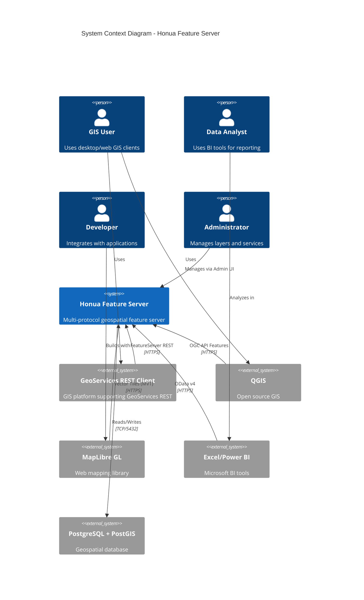

### Simplified Version (GitHub-compatible)

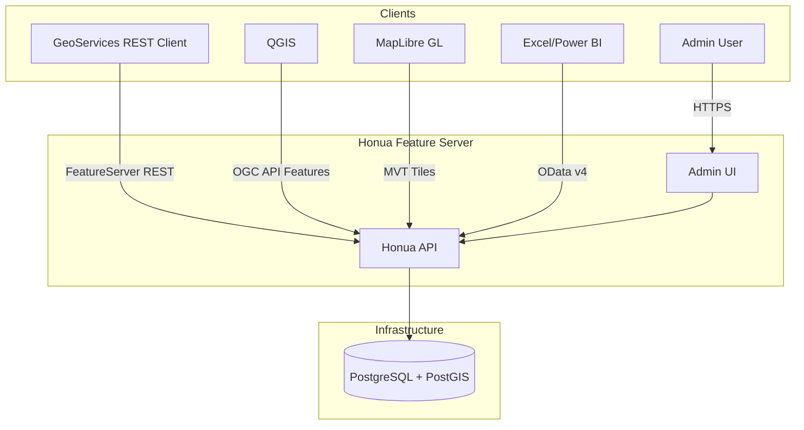

---

## 2. Container Diagram

Shows the deployable units that make up Honua.

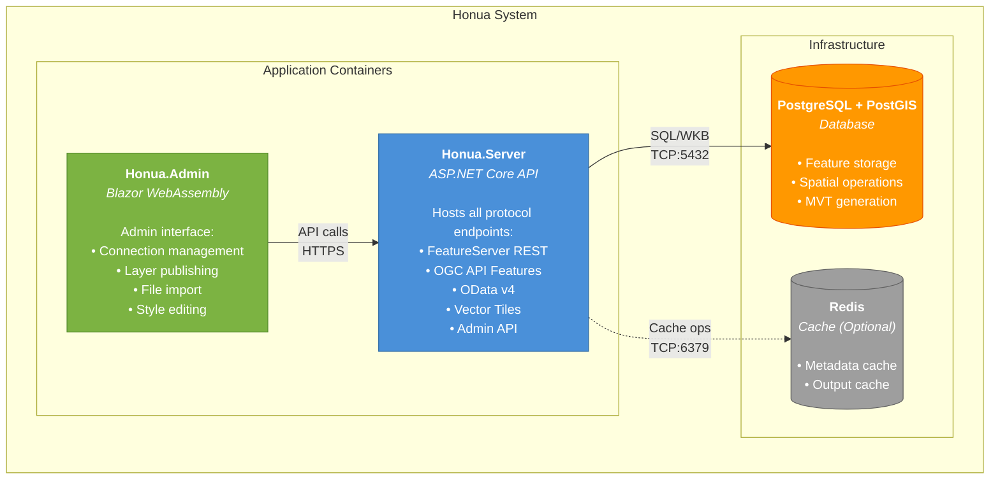

### Container Responsibilities

| Container | Technology | Responsibility |
|-----------|------------|----------------|
| **Honua.Server** | ASP.NET Core 10, Native AOT | API host, business logic, protocol translation |
| **Honua.Admin** | Blazor WebAssembly | Admin UI, served at `/admin` |
| **PostgreSQL + PostGIS** | PostgreSQL 16, PostGIS 3.4 | Data storage, spatial ops, MVT generation |
| **Redis** (optional) | Redis 7 | Metadata caching, output caching |

---

## 3. Component Diagram - Honua.Server

Shows the internal structure of the main API container.

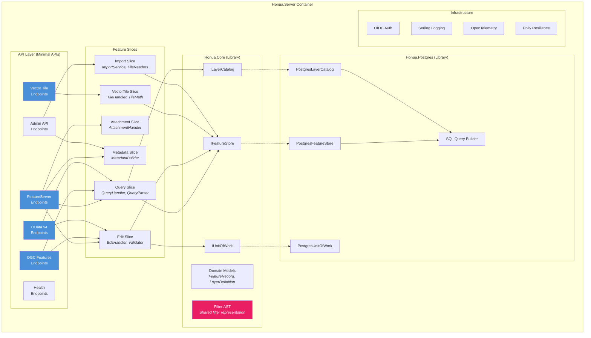

---

## 4. Vertical Slice Structure

Shows how a single feature slice is organized.

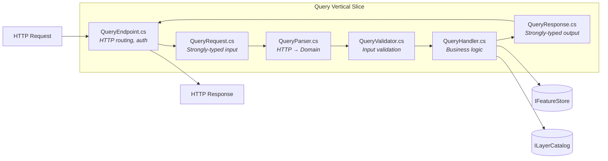

### Slice Dependencies (Max Limits)

| Component | Max Dependencies | Typical Dependencies |
|-----------|------------------|----------------------|
| Endpoint | 3-5 | Handler, Validator, Logger |
| Handler | 2-4 | IFeatureStore, ILayerCatalog |
| Parser | 1-2 | Options only |
| Validator | 1-2 | Options, Catalog |

---

## 5. Data Flow Diagram - Query Request

Shows how a query request flows through the system.

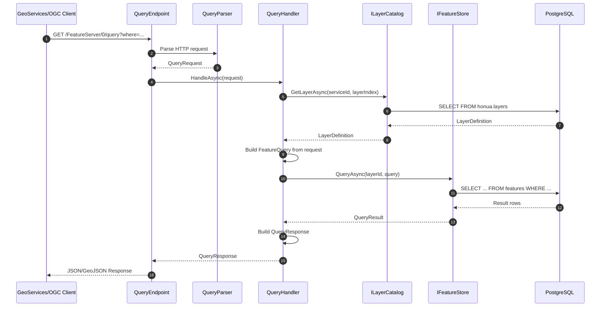

---

## 6. Data Flow Diagram - ApplyEdits Transaction

Shows transaction handling with savepoints.

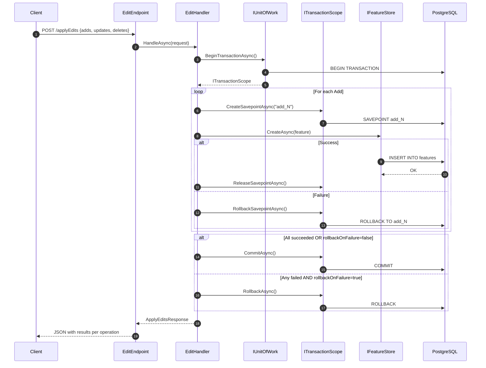

---

## 7. Filter Translation Pipeline

Shows how filters from different protocols converge on a shared AST.

```mermaid
graph LR
    subgraph "Protocol Parsers"
        GEOSERVICES[GeoServices WHERE<br/><i>population > 1000</i>]
        CQL[CQL2-Text<br/><i>population > 1000</i>]
        ODATA[OData $filter<br/><i>population gt 1000</i>]
    end

    subgraph "Honua.Core"
        AST[Filter AST<br/><i>BinaryExpression</i><br/><i>PropertyRef, Literal</i>]
    end

    subgraph "SQL Translation"
        SQL[SQL WHERE<br/><i>population > $1</i>]
        SPATIAL[PostGIS Spatial<br/><i>ST_Intersects(...)</i>]
    end

    ESRI --> AST
    CQL --> AST
    ODATA --> AST

    AST --> SQL
    AST --> SPATIAL

    style AST fill:#E91E63,color:#fff
```

### Filter AST Node Types

```
FilterExpression
├── BinaryExpression (AND, OR, =, <>, <, >, etc.)
├── UnaryExpression (NOT, IS NULL)
├── PropertyReference (field name)
├── Literal (string, number, boolean, null)
├── SpatialPredicate (INTERSECTS, CONTAINS, WITHIN)
├── GeometryLiteral (WKT, GeoJSON, Esri JSON)
└── FunctionCall (UPPER, LOWER, etc.)
```

---

## 8. Database Schema (ERD)

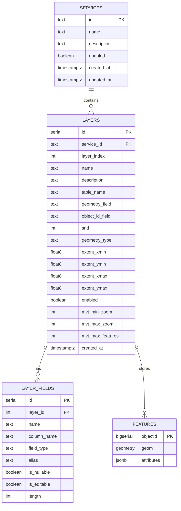

---

## 9. Admin UI Component Structure

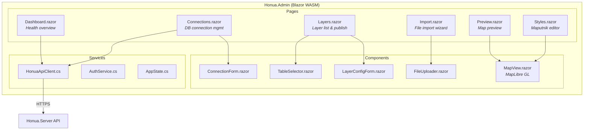

---

## 10. Deployment Architecture

### Kubernetes (Helm)

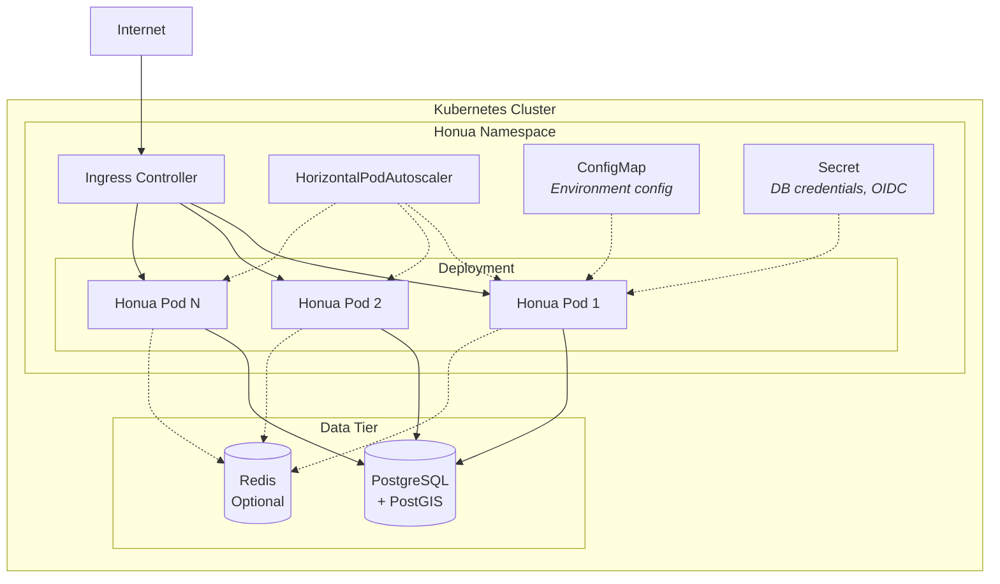

### Cloud Provider (AWS Example)

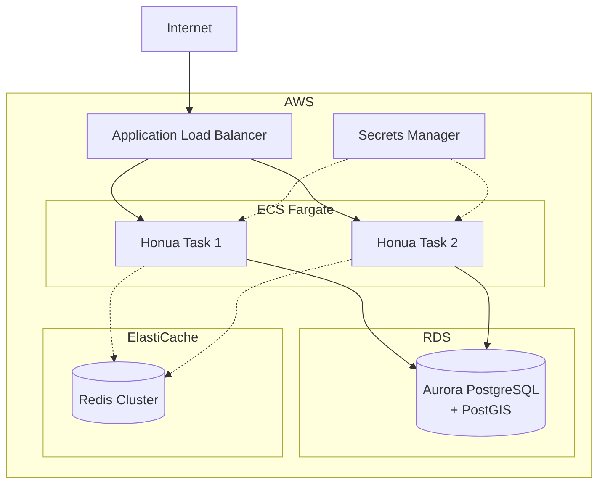

---

## Quick Reference

| Diagram | Purpose | When to Use |
|---------|---------|-------------|
| System Context | Show external interactions | Stakeholder discussions |
| Container | Show deployable units | Infrastructure planning |
| Component | Show internal structure | Developer onboarding |
| Sequence | Show runtime behavior | Debugging, documentation |
| ERD | Show data model | Database design |

---

## See Also

- [ARCHITECTURE.md](./ARCHITECTURE.md) - Detailed architecture prose
- [MVP_PLAN.md](./MVP_PLAN.md) - Implementation phases and criteria
- [ADRs](./adr/) - Architecture Decision Records
