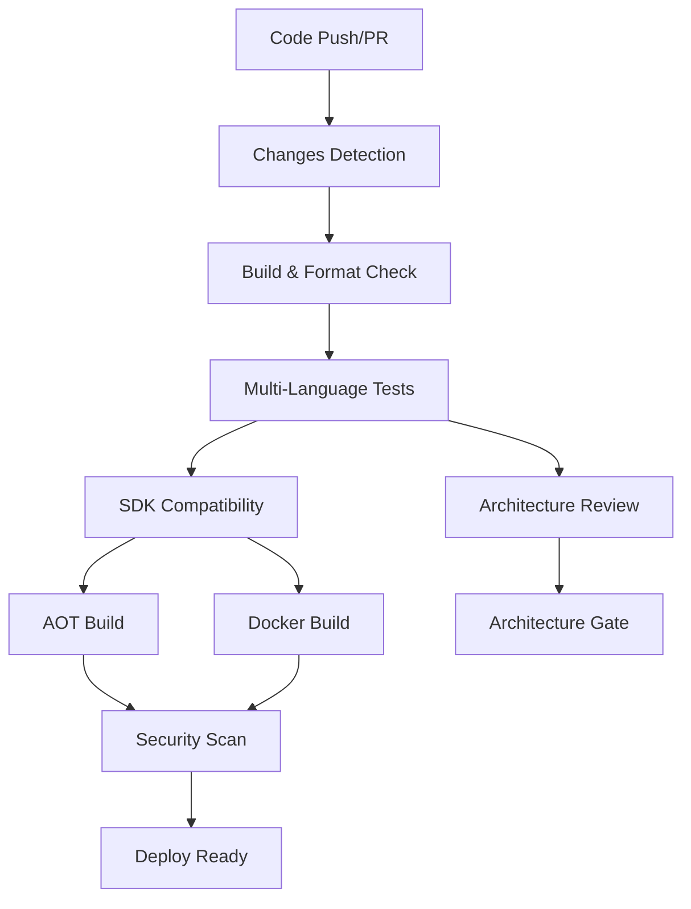
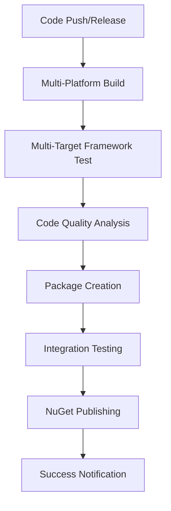
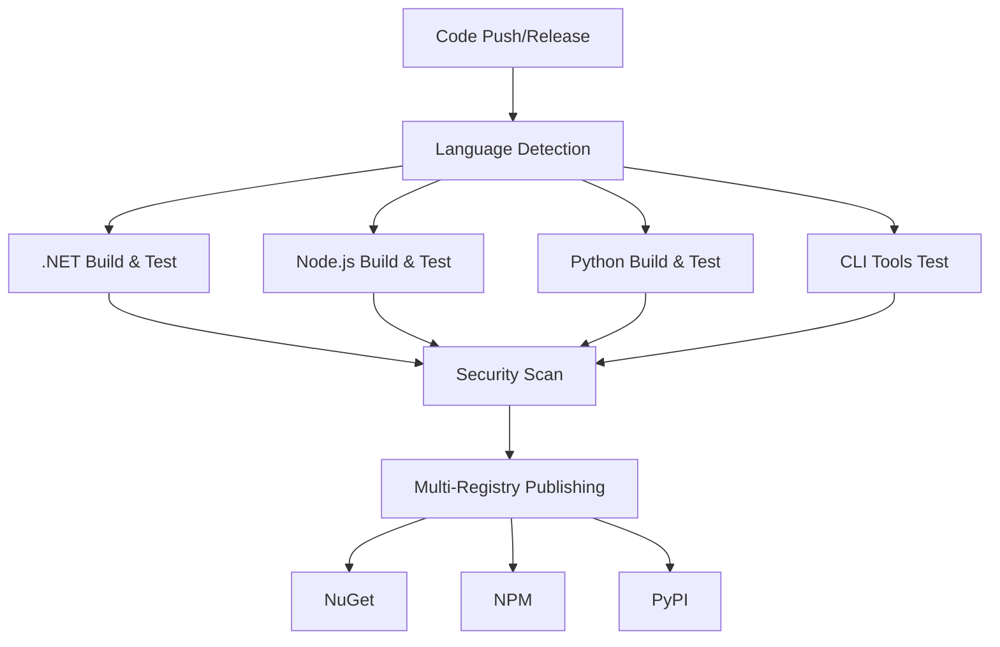
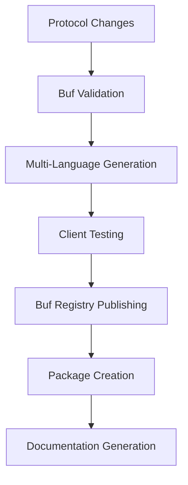
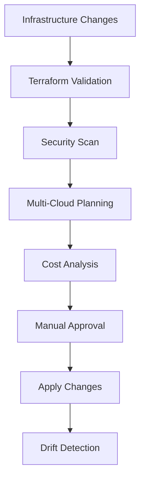

# Honua CI/CD Documentation

This document outlines the comprehensive CI/CD pipeline setup across all Honua repositories.

## Build Status Overview

### Core Repositories

| Repository | Build Status | Coverage | Security |
|------------|-------------|----------|----------|
| **honua-server** |  | [](https://codecov.io/gh/mikemcdougall/honua-server) |  |
| **honua-core-sdk** |  | [](https://codecov.io/gh/mikemcdougall/honua-core-sdk) |  |
| **honua-admin-tools** |  | [](https://codecov.io/gh/mikemcdougall/honua-admin-tools) |  |
| **geospatial-grpc** |  |  |  |

### Infrastructure

| Component | Status | Last Deployment |
|-----------|--------|----------------|
| **Terraform (AWS)** |  |  |
| **Terraform (Azure)** |  |  |
| **Docker Images** |  |  |

## Pipeline Architecture

### 1. honua-server Pipeline

**Workflow: `.github/workflows/ci.yml`**



**Key Features:**
- Multi-platform testing (Ubuntu, Windows, macOS)
- .NET, Python, and JavaScript test suites
- SDK compatibility validation
- AOT compilation verification
- Docker integration testing
- LLM-powered architecture review
- Security scanning with Trivy

**Deployment Triggers:**
- Push to `trunk` branch
- Pull requests to `trunk`
- Manual workflow dispatch

### 2. honua-core-sdk Pipeline

**Workflow: `honua-core-sdk-ci.yml` (to be deployed to honua-core-sdk repo)**



**Key Features:**
- Cross-platform builds (Linux, Windows, macOS)
- Multi-target framework validation (.NET 10, .NET Standard 2.1, mobile targets)
- Automated NuGet package publishing
- Integration testing with generated packages
- Code coverage reporting
- Security scanning

**Publishing:**
- Automatic on GitHub releases
- Manual with version input
- Prerelease support

### 3. honua-admin-tools Pipeline

**Workflow: `honua-admin-tools-ci.yml` (to be deployed to honua-admin-tools repo)**



**Key Features:**
- Multi-language support (.NET, Node.js, Python)
- Cross-platform CLI testing
- Multi-registry publishing (NuGet, NPM, PyPI)
- Language-specific security scanning
- Selective publishing controls

### 4. geospatial-grpc Pipeline

**Workflow: `geospatial-grpc-ci.yml` (to be deployed to geospatial-grpc repo)**



**Key Features:**
- Protocol buffer validation with Buf CLI
- Multi-language client generation (C#, JS, Python, Go)
- Breaking change detection
- Buf Schema Registry publishing
- Automated documentation generation
- Client package testing

### 5. Terraform Infrastructure Pipeline

**Workflow: `.github/workflows/terraform-ci.yml`**



**Key Features:**
- Multi-cloud support (AWS, Azure)
- Terraform validation and linting
- Security scanning with TFSec
- Cost analysis with Infracost
- Manual approval for production
- Automated drift detection

## Quality Gates

### Build Requirements
- All tests must pass
- Code coverage > 80%
- No security vulnerabilities (high/critical)
- Architecture review approval
- Format validation

### Security Gates
- Container vulnerability scanning
- Dependency vulnerability checking
- SAST (Static Application Security Testing)
- Infrastructure security validation

### Performance Gates
- AOT compilation success
- Docker image size < 100MB (target)
- Build time < 15 minutes
- Test suite completion < 30 minutes

## Deployment Strategy

### Environment Promotion

```
Developer → Feature Branch → PR → Trunk → Staging → Production
     ↓           ↓           ↓      ↓         ↓         ↓
   Local     CI Tests    Full CI   Deploy   Manual    Manual
   Tests      Only       Pipeline  Auto     Approval  Approval
```

### Release Process

1. **Pre-release Validation**
   - All CI/CD pipelines pass
   - Integration tests complete
   - Security scans clean
   - Architecture review approved

2. **Version Tagging**
   - Semantic versioning (v1.2.3)
   - Automated changelog generation
   - Release notes compilation

3. **Multi-Repository Publishing**
   - honua-server: Docker images + NuGet packages
   - honua-core-sdk: NuGet packages
   - honua-admin-tools: NuGet + NPM + PyPI packages
   - geospatial-grpc: Buf registry + client packages

4. **Deployment Coordination**
   - Infrastructure updates (Terraform)
   - Server deployment (Docker)
   - SDK availability verification
   - Documentation updates

## Monitoring & Notifications

### Build Notifications
- GitHub status checks
- Slack integration (if configured)
- Email notifications for failures

### Metrics Tracking
- Build success rates
- Test coverage trends
- Security vulnerability counts
- Deployment frequency
- Lead time for changes

## Troubleshooting

### Common Issues

1. **Build Failures**
   - Check format validation (`dotnet format`)
   - Verify test database availability
   - Review architecture violations

2. **Package Publishing Issues**
   - Validate API keys (NuGet, NPM, PyPI)
   - Check version conflicts
   - Verify package signing

3. **Infrastructure Deployment**
   - Check cloud provider credentials
   - Validate Terraform state
   - Review security group configurations

### Support Contacts
- **CI/CD Issues**: DevOps Team
- **Security Concerns**: Security Team
- **Infrastructure**: Platform Team

## Future Enhancements

### Planned Improvements
- [ ] Progressive deployment with feature flags
- [ ] Automated rollback capabilities
- [ ] Enhanced monitoring and alerting
- [ ] Multi-region deployment orchestration
- [ ] Advanced security scanning integration

### Performance Optimizations
- [ ] Parallel test execution
- [ ] Docker layer caching
- [ ] Dependency caching improvements
- [ ] Build artifact optimization