# Architecture

Honua is a geospatial server that publishes, queries, edits, and renders spatial data through standard protocols. It ships as a single container running one ASP.NET Core (.NET 10) process. There is no site model, no separate tile server, and no required sidecar: one process serves every protocol, the admin API, and the web endpoints.

That is the *serving* tier. Heavyweight geoprocessing runs in a separate container or batch service — see [Compute tier](#compute-tier) — and the shapes the serving tier is deployed in are in [Deployment topology](#deployment-topology).

[Architecture diagrams](architecture-diagrams.md) has twelve C4 diagrams — system context, containers, components, request and edit data flow, the filter translation pipeline, the schema ERD, and [Kubernetes and AWS deployment topology](architecture-diagrams.md#10-deployment-architecture).

## One process, two ports

| Port | Transport | Serves |
|---|---|---|
| `8080` | HTTP/1.1 (+ gRPC-Web) | All REST protocols, OGC services, admin API, health checks |
| `8081` | HTTP/2 cleartext (h2c) | Native gRPC (`geospatial.v1.*`) for SDK and mobile clients |

Honua does not terminate TLS, so a reverse proxy, ingress, or load balancer always sits in front. On most targets that edge is more than TLS: it is also the traffic-shifting control point Honua drives for canary rollouts and rollback — see [Deployment topology](#deployment-topology). Health probes are `GET /healthz/live` and `GET /healthz/ready`.

## Data flow

```mermaid
flowchart LR
  subgraph clients["Clients"]
    esri["ArcGIS Pro / Esri SDKs"]
    ogc["QGIS / MapLibre / Cesium"]
    bi["Excel / Power BI"]
    sdk["SDKs / gRPC / AI agents (MCP)"]
  end

  subgraph server["Honua Server — one process"]
    adapters["Protocol adapters"]
    pipeline["One shared pipeline<br/>query · edit · metadata · render"]
    adapters --> pipeline
  end

  subgraph storage["Storage"]
    postgis["PostGIS — read/write"]
    duckdb["DuckDB — read-only"]
    mssql["SQL Server — read-only"]
    oracle["Oracle — read-only"]
    mysql["MySQL / MariaDB — read-only"]
  end

  redis["Redis — optional<br/>shared cache · durable jobs"]
  files["File storage<br/>local · S3 · Azure Blob"]

  esri --> adapters
  ogc --> adapters
  bi --> adapters
  sdk --> adapters

  pipeline --> postgis
  pipeline --> duckdb
  pipeline --> mssql
  pipeline --> oracle
  pipeline --> mysql

  pipeline -.-> redis
  pipeline -.-> files
```

Dashed edges are optional infrastructure: remove Redis and the server still
runs, with caching falling back to in-memory and the durable job and workflow
endpoints reporting unavailable.

Every protocol endpoint is a thin adapter over the same canonical query, edit, metadata, and rendering pipeline. Publish a layer once and it is served simultaneously through every protocol its service enables — see [Data model](data-model.md) and the [protocol matrix](protocols.md).

## Storage

**PostGIS is the primary store.** It is the only provider with full read/write support: editing, attachments, replicas, versioning, raster mosaics, and native vector tile generation all run against PostgreSQL/PostGIS. Migrations run automatically on startup.

**Read-only providers** serve existing databases in place, without copying data into PostGIS:

| Provider | Source | Typical use |
|---|---|---|
| DuckDB | Embedded `.duckdb` file | Analytical or reference data without external database infrastructure |
| SQL Server | `geometry`/`geography` tables | Serve enterprise SQL Server spatial tables as-is |
| Oracle | `SDO_GEOMETRY` tables | Serve standard Oracle Spatial tables (ArcSDE `ST_Geometry` and versioned tables are refused) |
| MySQL/MariaDB | User-managed spatial tables (MySQL 8.0.11+ / MariaDB 10.6+) | Serve existing MySQL spatial data |

Read-only providers support query, count, extent, and pagination; they report unsupported capabilities (edits, statistics, native MVT) honestly rather than emulating them. Per-provider details and limits are in the [data source configuration reference](../reference/configuration/data-sources/README.md).

## Optional infrastructure

- **Redis** — distributed caching for multi-node deployments, and the durable store for background jobs and workflow orchestration. Without Redis, caching falls back to in-memory and durable job/workflow endpoints report unavailable.
- **File storage** — attachments, imports, and raster assets use the local filesystem by default; S3-compatible storage (including MinIO) and Azure Blob Storage are configurable alternatives (`FileStorage__Provider`).

## Compute tier

The serving image is deliberately lean: the native-AOT web images contain no GDAL/OGR CLI, no
native GDAL/PROJ/GEOS libraries, and no .NET GDAL bindings. Query, edit, render, and the managed
geoprocessing processes all run in-process. Thirty of the 98 geoprocessing processes declare
`RuntimeProfile = native` and cannot: they execute out-of-process in the heavyweight GDAL/PDAL
worker image (`docker/worker-gdal/Dockerfile`, ADR-0038).

**A deployment without the GDAL worker cannot run any native process** — all `surface.*`, all
`raster.*`, the native `conversion.*` idioms, `proximity.euclidean-*`, `source.ogr`, `gdal.*`, and
`pcloud.translate`. The lean image still validates their plans, then fails the execution rather than
emulating it. See the [geoprocessing operations reference](../reference/geoprocessing-operations.md).

Where that worker runs is the batch-compute backend, selected per workload under
`ControlPlane:ExecutionWorkloads`:

| Backend | Runs work as | Scope |
|---|---|---|
| `local` | In-process worker loop | Single host |
| `honua-local-process` | Child-process pool | Single host |
| `honua-kubernetes-job` | A Kubernetes Job per execution | Cluster |
| `honua-aws-batch` | An AWS Batch job | AWS |
| `honua-azure-batch` | An Azure Batch task | Azure |

The job queue, execution-job store, log store, and result-package store are all Redis-backed, so
**Redis is required for any deployment that runs jobs** — without it a submitted job stays in
`accepted` and never drains.

The two local backends are single-host only. They track launched jobs in an in-process registry that
cannot survive a host restart or be seen from another node, so they do not work on a serverless
substrate (frozen or torn-down process and filesystem) or on a multi-node deployment without a shared
work directory. Declare the substrate — `ControlPlane:Substrate:Profile` set to `MultiNode` or
`Serverless`, plus `ControlPlane:Substrate:SharedWorkDir` — and the server fails closed with a
Critical `local-backend-substrate-incompatible` ops finding instead of re-queuing doomed jobs.

Routing details are in [Routing geoprocessing jobs to AWS Batch](../operator/geoprocessing-aws-batch.md)
and the [ops control plane section](../guides/deploy/cloud-deployments.md#ops-control-plane-and-batch-compute-backends).

## Deployment topology

The same image runs in three shapes.

**Single container.** One process, one host, local file storage; Redis optional unless you run jobs.
Docker Compose evaluation stacks and air-gapped single-host installs. Not zero-downtime.

**Stateless replicas behind an edge.** The production shape: several identical containers sharing one
PostGIS, one Redis, and one file store, behind an ALB, ingress, or Application Gateway. No session
affinity is needed. That edge terminates TLS *and*, on most targets, carries out rollouts — Honua's
deploy API shifts weights or swaps revisions through it:

| Target | Deploy backend | Rollout mechanism |
|---|---|---|
| Kubernetes + Argo Rollouts | `honua-kubernetes-argo-rollouts` | Canary analysis |
| AWS ECS/Fargate | `honua-aws-ecs-alb` | ALB weighted target groups |
| AWS Lambda | `honua-gitops-aws-lambda` | Alias weighted versions |
| Azure Container Apps | `honua-azure-container-apps-revision` | Revision traffic split |
| Azure Functions | `honua-gitops-azure-functions` | Staging slot swap |

GitOps passthrough variants (`honua-gitops-kubernetes`, `honua-gitops-aws-ecs`,
`honua-gitops-azure-container-apps`) hand off to your GitOps repository instead of acting directly;
they report `rollbackSupported: false`, because Honua cannot revert a workload it does not drive.

**Self-hosted rolling.** For on-prem and air-gapped hosts with no platform control plane, the server
embeds a YARP reverse proxy (`ControlPlane:SelfHosted`, off by default). It runs the active and
standby replicas on loopback ports, health-gates the standby, and swaps the proxy destination at
cutover — the same canary-and-rollback contract as the cloud backends, with no cloud. Backend:
`honua-yarp-rolling`.

Rollback is capability-gated, not assumed: the `deploy.rollback` capability is advertised only when a
configured target's backend implements a real revert. See
[Upgrade and roll back](../guides/deploy/upgrade-and-rollback.md) for the gate contract and the
rollback taxonomy.

Per-target provisioning, image families, and the honua-iac modules are in
[Cloud deployment patterns](../guides/deploy/cloud-deployments.md); the Kubernetes and AWS topology
diagrams are in [Architecture diagrams](architecture-diagrams.md#10-deployment-architecture).

## Scaling

Server instances are stateless: catalog state lives in PostGIS, shared cache and job state in Redis, and files in the configured file store. To scale, run more containers behind a load balancer and point them at the same PostgreSQL, Redis, and file storage. The same image runs single-node evaluation stacks and multi-node production deployments.

## Observability and security

- Structured JSON logging (Serilog), OpenTelemetry tracing, and a Prometheus metrics endpoint.
- Authentication: API key, OIDC (license-gated), ArcGIS portal token compatibility (`/sharing/rest/generateToken`), and optional mTLS client certificates.
- Authorization: per-service and per-layer access policies with role-based control, enforced in the shared pipeline for every protocol.

See [Authentication](../guides/secure/authentication.md) and [TLS and mTLS](../guides/secure/tls-and-mtls.md).

## Where to go next

- [Quickstart](../get-started/quickstart.md) — run the server with Docker Compose
- [Protocols](protocols.md) — the full protocol-to-endpoint matrix
- [Data model](data-model.md) — connections, layers, services, and styles
- [Docker Compose deployment](../guides/deploy/docker-compose.md) and [Kubernetes](../guides/deploy/kubernetes.md)
- [Cloud deployment patterns](../guides/deploy/cloud-deployments.md) — ECS/Fargate, Lambda, Container Apps, Functions, EKS/AKS
- [Upgrade and roll back](../guides/deploy/upgrade-and-rollback.md) — canary gates, rollback taxonomy
- [Operations](../guides/deploy/backup-and-restore.md) — jobs, workflows, monitoring
