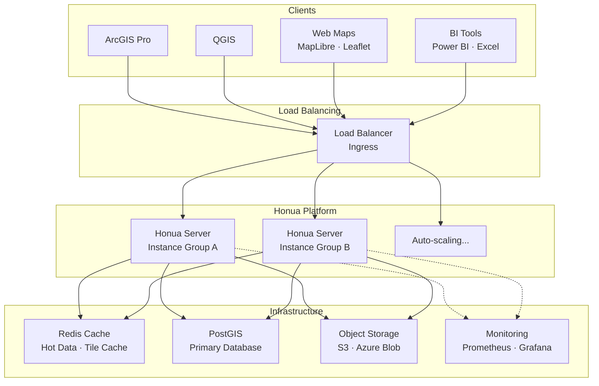
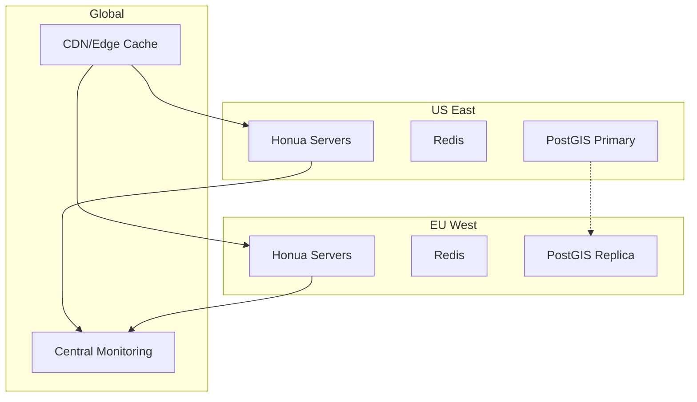

# Architecture Overview

This document describes the current Honua Server architecture and the constraints that shape the codebase.

## Goals

- **PostGIS-native**: treat PostgreSQL/PostGIS as the source of truth with no ETL.
- **Open standards**: serve multiple GIS and data protocols from one dataset.
- **Clean dependencies**: `Honua.Core` <- `Honua.Postgres` <- `Honua.Server`.
- **Minimal API surface**: endpoints are defined with Minimal APIs, not MVC controllers.
- **AOT-friendly**: avoid reflection in hot paths and use source-generated JSON/logging.

## Solution Layout

```
src/
├── Honua.Server/     # ASP.NET Core host + Minimal API endpoints
├── Honua.Core/       # Domain models + abstractions
├── Honua.Postgres/   # PostgreSQL/PostGIS implementation
└── Honua.Admin/      # Blazor WASM admin UI
```

Key points:
- **Honua.Core** defines domain models, protocol DTOs, and abstractions.
- **Honua.Postgres** implements Core interfaces using raw Npgsql and PostGIS.
- **Honua.Server** composes endpoints and handlers, using Core + Postgres.
- **Honua.Admin** is a standalone UI that talks to the Admin API.

## Feature Slices (Server)

The server is organized by vertical slices under `src/Honua.Server/Features/`.

- **FeatureServer**: GeoServices REST query/edit/attachments/related records.
- **MapServer**: GeoServices REST map rendering (export/identify/legend) + layer query.
- **OGC Features**: collections/items with transactions.
- **OGC Tiles**: tilesets metadata and vector tiles.
- **OData**: CRUD + query options ($filter, $select, $orderby, $top, $skip, $count, $search, $apply, $batch).
- **Tiles**: MVT + TileJSON.
- **Admin**: connections, publishing, metadata, styles, imports, operations, observability.
- **Import**: file import pipeline + Esri service import.

## Data Access (Postgres)

- **Raw Npgsql**: no ORM.
- **QueryBuilder + DataAccess** split:
  - `FeatureQueryBuilder` constructs parameterized SQL.
  - `FeatureDataAccess` executes queries and maps results.
- **Prepared statement cache** is optional and uses safe parameter binding.
- **JSONB attributes** are accessed via validated field names and parameterized values.

## Configuration and Limits

- Configuration is environment-variable friendly with source-generated validation.
- Shared limits are enforced across protocols (`Limits__*`).
- Secret references are supported for connection strings and admin credentials.

## Security

- Admin APIs are protected with API keys and OIDC (when enabled).
- Public protocol endpoints are read/write based on server configuration and limits.
- No in-app audit/compliance storage is implemented; use external tooling if needed.

## Observability

- OpenTelemetry-based instrumentation is wired into the host.
- Built-in endpoints provide health and metrics snapshots:
  - `/healthz/live`, `/healthz/ready`
  - `/api/v1/admin/performance/*`
  - `/api/v1/admin/observability/*`

## Testing

- Integration tests use Testcontainers + PostGIS.
- Architecture tests enforce dependency direction and endpoint coverage.
- Performance benchmarks live under `benchmarks/`.

## Architectural Constraints (Enforced)

- **No controllers**: Minimal APIs only.
- **Dependency flow**: Core <- Postgres <- Server.
- **Public API docs**: all public types require XML documentation.
- **AOT compatibility**: reflection avoided in hot paths; source-gen JSON.

## Deployment Architecture

Honua is designed for cloud-native deployment with multiple infrastructure options and external dependencies for caching, storage, and observability.

### **Overall Topology**



*For the complete visual diagram, see the [homepage architecture diagram](https://honua.io/#diagram-section)*

### **Infrastructure Components**

#### **Redis Cache (Optional but Recommended)**
- **Purpose**: Response caching, tile caching, hot data storage
- **Usage**:
  - Caches OGC Feature Collections, FeatureServer responses, MapServer responses
  - Stores pre-generated vector tiles for frequently accessed areas
  - Session data for admin UI (when using distributed deployments)
- **Configuration**: `CacheOptions__*` environment variables
- **Fallback**: Memory cache when Redis unavailable (not recommended for production)

#### **Object Storage (Required for File Operations)**
- **Purpose**: File uploads, import staging, export generation
- **Supported**: AWS S3, Azure Blob Storage, S3-compatible storage
- **Usage**:
  - Temporary storage during file imports (GeoJSON, Shapefile, etc.)
  - Persistent storage for large datasets
  - Export file generation and delivery
- **Configuration**: `Storage__*` environment variables

#### **PostGIS Database (Required)**
- **Purpose**: Primary data store, spatial operations, metadata
- **Requirements**: PostgreSQL 15+ with PostGIS 3.3+
- **Usage**:
  - All feature data storage
  - Spatial indexing and query processing
  - Layer metadata and configuration
  - Connection string encryption and management

#### **Monitoring & Observability (Recommended)**
- **OpenTelemetry**: Built-in instrumentation for traces, metrics, logs
- **Prometheus**: Metrics collection via `/metrics` endpoint
- **Grafana**: Dashboard visualization
- **Health Checks**: `/healthz/live` and `/healthz/ready` endpoints

### **Deployment Patterns**

#### **Container-First Design**
Honua is built for container deployments with stateless server instances:

```dockerfile
# Example deployment
FROM honuaio/honua-server:latest
ENV ConnectionStrings__DefaultConnection="Host=postgres;Database=honua;Username=postgres;Password=postgres"
ENV CacheOptions__Redis__ConnectionString="redis:6379"
ENV Storage__Provider="S3"
ENV Storage__S3__BucketName="honua-uploads"
```

#### **Kubernetes (Production Recommended)**
- **Horizontal Pod Autoscaler**: Scale based on CPU/memory/request rate
- **Ingress Controllers**: Handle load balancing and TLS termination
- **ConfigMaps/Secrets**: Environment-specific configuration
- **Persistent Volumes**: PostGIS data persistence
- **Service Mesh**: Optional (Istio, Linkerd) for advanced networking

Example Kubernetes architecture:
```yaml
apiVersion: apps/v1
kind: Deployment
metadata:
  name: honua-server
spec:
  replicas: 3
  selector:
    matchLabels:
      app: honua-server
  template:
    spec:
      containers:
      - name: honua
        image: honuaio/honua-server:latest
        env:
        - name: ConnectionStrings__DefaultConnection
          valueFrom:
            secretKeyRef:
              name: database-secret
              key: connection-string
```

#### **Serverless Deployments**
For variable or low-traffic workloads:

**AWS Lambda + RDS:**
- Cold start: ~500ms (optimized for .NET 8 AOT)
- Concurrent executions: 1000+ (configurable)
- Database: RDS PostgreSQL with PostGIS
- Storage: S3 for file operations

**Azure Functions + Flexible Server:**
- Runtime: .NET 8 isolated worker
- Scaling: Consumption or Premium plans
- Database: Azure Database for PostgreSQL
- Storage: Azure Blob Storage

#### **Multi-Region Deployments**
For global deployments with regional data:



### **Performance Characteristics**

#### **Scaling Patterns**
- **Stateless Servers**: All Honua instances are identical and stateless
- **Database-Bound**: Performance typically limited by PostGIS query performance
- **Cache-Accelerated**: Redis dramatically improves response times for repeated queries
- **Horizontal Scaling**: Add instances behind load balancer for increased throughput

#### **Resource Requirements**
**Minimum (Development):**
- CPU: 0.5 cores
- Memory: 512MB
- Database: 1GB storage

**Production (Per Instance):**
- CPU: 1-2 cores
- Memory: 1-4GB
- Database: Varies by dataset size
- Redis: 1-8GB depending on cache strategy

#### **Network Topology**
- **Public Endpoints**: Standards APIs (FeatureServer, MapServer, OGC, OData, Tiles)
- **Private Endpoints**: Admin API (typically behind VPN/private network)
- **Database Access**: Private network only (never public)
- **Cache Access**: Private network, shared across instances

### **Configuration Management**

#### **Environment-Based Config**
All deployment options use environment variables for configuration:

```bash
# Database
ConnectionStrings__DefaultConnection="Host=db;Database=honua;Username=postgres;Password=..."

# Caching
CacheOptions__Provider="Redis"
CacheOptions__Redis__ConnectionString="redis:6379"

# Storage
Storage__Provider="S3"
Storage__S3__BucketName="honua-files"
Storage__S3__Region="us-west-2"

# Security
HONUA_ADMIN_PASSWORD="secure-password"
Authentication__Oidc__Authority="https://auth.example.com"

# Observability
OTEL_EXPORTER_OTLP_ENDPOINT="http://jaeger:14268"
```

#### **Secret Management**
- **Kubernetes**: Use Secrets and ConfigMaps
- **AWS**: Parameter Store or Secrets Manager
- **Azure**: Key Vault integration
- **Docker**: Environment files or swarm secrets

### **High Availability Considerations**

#### **Database HA**
- **Primary/Replica**: Read replicas for query scaling
- **Backup Strategy**: Automated PostGIS backups
- **Failover**: Automatic failover with connection retry logic

#### **Cache HA**
- **Redis Cluster**: Multi-node setup for redundancy
- **Cache Fallback**: Graceful degradation to database-only mode
- **Cache Warming**: Pre-populate frequently accessed data

#### **Application HA**
- **Multiple Instances**: Always run 2+ instances in production
- **Health Checks**: Kubernetes/load balancer health monitoring
- **Rolling Updates**: Zero-downtime deployments
- **Circuit Breakers**: Fail fast when dependencies unavailable

For detailed deployment instructions and examples, see:
- [Deployment Scenarios](../devops/DEPLOYMENT_SCENARIOS.md) - Specific deployment patterns
- [DevOps Overview](../devops/README.md) - Operational docs and checklists
- [Performance Monitoring](../devops/performance-monitoring.md) - Observability setup
