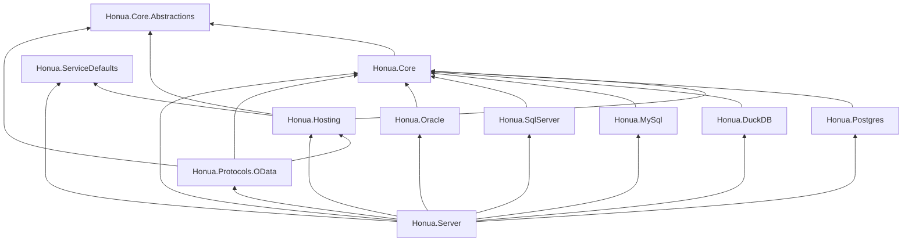

# Architecture Overview

A one-page map of how the .NET projects in `src/` fit together. New
contributors should read this before opening a PR that adds, moves, or
references a new project.

The full rationale for each tier lives in the cross-linked ADRs at the
bottom; this document is the compact reference.

---

## The Five Tiers

Honua server is layered as five tiers with a strict, one-way dependency
direction. From bottom (most depended on) to top (most dependent):

| Tier | Project(s) | Responsibility |
|------|-----------|----------------|
| **1. Abstractions** | `Honua.Core.Abstractions` | Public contract surface: interfaces, DTOs, attributes, option records. Zero heavy package dependencies. Reference assembly for protocol modules. |
| **2. Core** | `Honua.Core` | Default implementations of the abstractions, shared domain primitives (filter AST, metadata v2 graph, security helpers, geometry helpers). Provider-agnostic. |
| **3. Hosting** | `Honua.Hosting` | Cross-cutting host concerns extracted from `Honua.Server`: routing, validation, authentication wiring, OpenAPI plumbing, infrastructure conventions. Independent of any HTTP protocol module. |
| **4a. Storage providers** | `Honua.Postgres`, `Honua.DuckDB`, `Honua.MySql`, `Honua.SqlServer`, `Honua.Oracle` | One assembly per database backend; each depends only on `Honua.Core`. |
| **4b. Protocol modules** | `Honua.Protocols.OData` (and future siblings) | One assembly per HTTP protocol surface. Depend on Abstractions + Core + Hosting; never on `Honua.Server` (that's the cycle Phase 1 is solving). |
| **5. Server** | `Honua.Server` | Composition root. References every storage provider and every protocol module and wires them into an executable host. |

`Honua.ServiceDefaults` sits sideways from this stack — it carries shared
.NET Aspire defaults and is referenced by both `Honua.Hosting` and
`Honua.Server`.

---

## Dependency-direction invariant

These are enforced by the architecture-tests under
`tests/dotnet/Honua.Architecture.Tests`. PRs that violate them fail CI.

- `Abstractions` **never** references `Core`.
- `Core` **never** references `Hosting`.
- `Hosting` **never** references `Server`, nor any protocol module, nor any
  storage provider.
- Storage providers **never** reference each other and **never** reference
  `Hosting`, `Server`, or any protocol module.
- Protocol modules **never** reference `Server`, nor each other, nor any
  storage provider.
- `Server` is the only assembly allowed to reference both storage providers
  and protocol modules.

In short: arrows point **down** the table above; never sideways within a
tier, never up.

---

## Mermaid view

The graph is rendered bottom-up: every arrow points from a consumer to
something it depends on. There must be no back edges.

---

## When you add a new project

1. Decide which tier it belongs to using the table above.
2. Add `ProjectReference` entries **only** to tiers strictly below it.
3. If it's a protocol module, name it `Honua.Protocols.<Name>` and have it
   depend on `Hosting`, never on `Server`.
4. If it's a storage provider, name it `Honua.<Backend>` and have it depend
   on `Core` only.
5. Add an architecture test (under `Honua.Architecture.Tests`) that asserts
   the new assembly does not back-edge into a higher tier.
6. Cross-link the new project from this overview if it introduces a new
   tier or pattern.

---

## Related ADRs

- [ADR-0041 Core.Abstractions extraction](adr/0041-core-abstractions-extraction.md) — why Tier 1 exists and what moves into it.
- [ADR-0042 Per-protocol test project split](adr/0042-per-protocol-test-project-split.md) — mirrors the protocol-module split on the test side.
- [ADR-0043 Modularization CI rework](adr/0043-modularization-ci-rework.md) — how the build/CI shards line up with the tiers.
- [ADR-0044 Server infrastructure decomposition](adr/0044-server-infrastructure-decomposition.md) — how `Honua.Hosting` was carved out of `Honua.Server`.
- [ADR-0045 Migration sequence renumbering deferral](adr/0045-defer-migration-sequence-collision-renumbering.md) — why duplicate DbUp numbers are allowed during the cutover.
- [ADR-0046 IDatabaseSession progressive migration](adr/0046-audit-c3-database-session-progressive-migration.md) — how the abstractions surface is being narrowed without forcing a big-bang.

See also: [ARCHITECTURE.md](ARCHITECTURE.md) for the legacy, pre-modularization layered
view; [ARCHITECTURE_DIAGRAMS.md](ARCHITECTURE_DIAGRAMS.md) for runtime/topology
diagrams.
