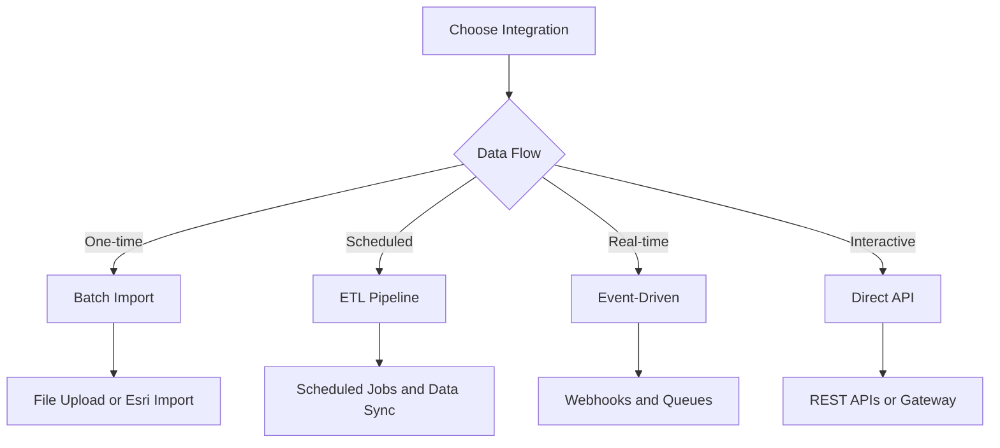

# Integration Patterns

This guide helps you choose a sensible integration approach for Honua Server and gives short, practical starter snippets. It is intentionally concise.

**Scope**: Picking a pattern, understanding tradeoffs, and getting a minimal working integration. For full protocol details and request/response examples, use the links at the end.

## **Integration Decision Matrix**

| Pattern | Use Case | Complexity | Best Protocol | Benefits |
|---------|----------|------------|---------------|----------|
| **Direct API** | Simple CRUD and queries | Low | OGC API Features | Standards-compliant, simple |
| **SDK Wrapper** | App integration | Medium | Multiple protocols | Type safety, shared errors |
| **ETL Pipeline** | Batch sync and backfills | Medium | OData v4 + FeatureServer (writes) + MapServer (optional) | Scheduled processing |
| **Event-Driven** | Real-time updates | High | Webhooks + API | Reactive, scalable |
| **Microservice** | Service architecture | High | All protocols | Decoupled, fault-tolerant |



---

## **Pattern 1: Direct API Integration**

**Best for**: Simple apps, prototypes, direct client access
**Complexity**: Low
**Protocols**: OGC API Features (recommended), FeatureServer REST, MapServer REST (maps)

### **Frontend Web Application (OGC API Features)**

```javascript
export async function fetchFeatures(collectionId, { bbox, limit = 100, filter }) {
  const params = new URLSearchParams({ limit });
  if (bbox) params.append('bbox', bbox.join(','));
  if (filter) {
    params.append('filter', filter);
    params.append('filter-lang', 'cql2-text');
  }

  const response = await fetch(
    `${process.env.HONUA_URL}/ogc/features/collections/${collectionId}/items?${params}`
  );
  if (!response.ok) throw new Error(`HTTP ${response.status}`);
  return response.json();
}
```

### **GIS Clients (ArcGIS/QGIS)**

- **ArcGIS Pro (data)**: `http://<host>/rest/services/{id}/FeatureServer`
- **ArcGIS Pro (maps)**: `http://<host>/rest/services/{id}/MapServer`
- **QGIS (OGC API Features)**: `http://<host>/ogc/features`

---

## **Pattern 2: SDK/Client Library Pattern**

**Best for**: Shared client code across web, mobile, and server apps
**Complexity**: Medium
**Protocols**: OGC API Features + FeatureServer (optional) + MapServer (optional)

### **Minimal TypeScript Client**

```typescript
export class HonuaClient {
  constructor(private baseUrl: string, private apiKey?: string) {}

  private async request(path: string, options: RequestInit = {}) {
    const headers = { 'Content-Type': 'application/json', ...options.headers } as Record<string, string>;
    if (this.apiKey) headers['X-API-Key'] = this.apiKey;
    const response = await fetch(`${this.baseUrl}${path}`, { ...options, headers });
    if (!response.ok) throw new Error(`HTTP ${response.status}`);
    return response.json();
  }

  getFeatures(collectionId: string, query = '') {
    const suffix = query ? `?${query}` : '';
    return this.request(`/ogc/features/collections/${collectionId}/items${suffix}`);
  }

  createFeature(collectionId: string, feature: unknown) {
    return this.request(`/ogc/features/collections/${collectionId}/items`, {
      method: 'POST',
      headers: { 'Content-Type': 'application/geo+json' },
      body: JSON.stringify(feature)
    });
  }
}
```

**Keep SDKs small**: focus on request building, auth, and error translation. Let app code handle domain rules.

---

## **Pattern 3: ETL Pipeline Integration**

**Best for**: Scheduled syncs, batch imports, backfills
**Complexity**: Medium
**Protocols**: OData v4 (read), FeatureServer (write), MapServer (optional rendering), Admin API (management)

### **Minimal ETL Loop (Python)**

```python
import requests

HONUA = "http://localhost:8080"
API_KEY = "your-api-key"

# Extract from a source system (DB, SaaS API, file, etc.)
source_rows = fetch_source_rows()

# Transform into GeoJSON Features
features = [row_to_feature(row) for row in source_rows]

# Load into Honua
resp = requests.post(
    f"{HONUA}/rest/services/1/FeatureServer/0/addFeatures",
    json={"features": features},
    headers={"X-API-Key": API_KEY}
)
resp.raise_for_status()
```

### **Analytics Export (GeoParquet)**

```python
import requests

HONUA = "http://localhost:8080"

# Export features as GeoParquet for columnar analytics
resp = requests.get(
    f"{HONUA}/rest/services/1/FeatureServer/0/query",
    params={"where": "1=1", "outFields": "*", "f": "parquet"}
)
resp.raise_for_status()

with open("features.parquet", "wb") as f:
    f.write(resp.content)

# Load directly into DuckDB, pandas, or geopandas
import geopandas as gpd
gdf = gpd.read_parquet("features.parquet")
```

Use `f=parquet` (or `Accept: application/vnd.apache.parquet`) to get GeoParquet 1.1.0 output with WKB-encoded geometry and CRS metadata. Ideal for analytics pipelines, data science notebooks, and bulk data exchange. Non-4326 `outSR` is rejected when the GeoParquet response includes a geometry column; it is allowed when `returnGeometry=false` or the layer has no geometry. When `outSR` is omitted, coordinates are automatically reprojected to EPSG:4326.

> **Truncation note:** The query endpoint applies `maxRecordCount` by default (typically 2 000 features). Binary formats like GeoParquet do not include an `exceededTransferLimit` flag. To verify completeness, compare the row count in the returned file against the service's `maxRecordCount`. For larger exports, page with `resultOffset`/`resultRecordCount` or first call `returnCountOnly=true` to check the total.

**Orchestrators**: Use Airflow, Dagster, Prefect, or your existing ETL platform. The goal is consistent extraction, idempotent loads, and observability.

---

## **Pattern 4: Event-Driven Integration**

**Best for**: Real-time updates and reactive systems
**Complexity**: High
**Protocols**: Webhooks + any protocol for data sync

### **Webhook -> Queue -> Worker (Conceptual)**

```python
# 1) Webhook handler receives event
@app.post("/webhook")
async def handle_event(event: dict):
    await queue.publish(event)
    return {"ok": True}

# 2) Worker consumes and syncs
async def worker_loop():
    event = await queue.consume()
    feature = transform_event_to_feature(event)
    await honua.create_feature(collection_id="assets", feature=feature)
```

**Key decision**: separate ingest from sync so spikes don't overload your API.

---

## **Pattern 5: Microservice Integration**

**Best for**: Service-oriented architectures, API gateways
**Complexity**: High
**Protocols**: All protocols behind a gateway

### **Gateway Resolver (TypeScript)**

```typescript
@Resolver()
class FeaturesResolver {
  constructor(private honua: HonuaClient) {}

  @Query(() => [Feature])
  async features(@Arg("collectionId") id: string) {
    const result = await this.honua.getFeatures(id);
    return result.features;
  }
}
```

**When to use**: Only when you already have a gateway or strict service boundaries. Otherwise, direct API is simpler.

---

## **Related Documentation**

- [Geospatial API Examples](API_EXAMPLES.md)
- [Protocols Overview](STANDARDS_APIS.md)
- [Admin API Reference](CONTROL_PLANE_API.md)
- [User Journeys](USER_JOURNEYS.md)
