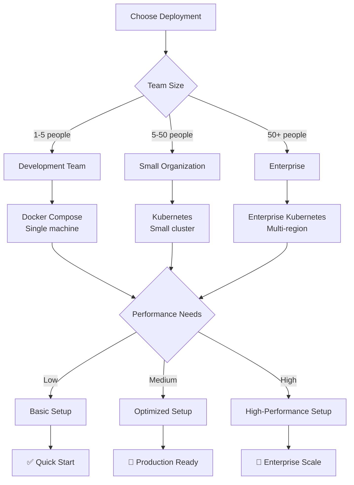
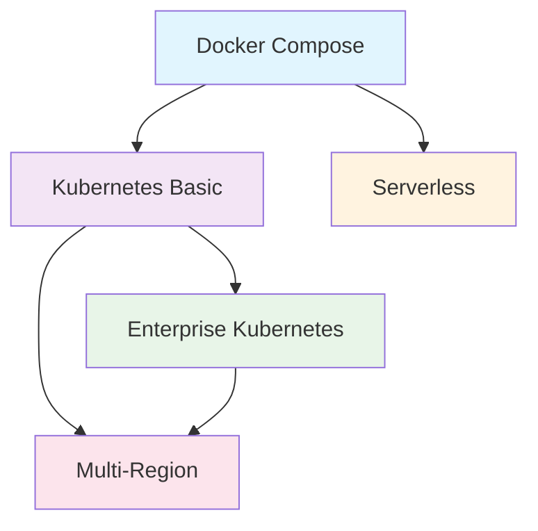

# Deployment Scenarios

This guide covers specific deployment scenarios for different use cases, from small team setups to enterprise-scale deployments.

## 📋 **Deployment Decision Tree**



*📸 Placeholder: Interactive deployment scenario selector*

---

## 🚀 **Scenario 1: Development Team (1-5 people)**

**Use Case**: Small team, development/testing environment, low traffic
**Infrastructure**: Single machine or small cloud instance

### **Docker Compose Setup** ⚡ *5 minutes*

```yaml
# docker-compose.yml
version: '3.8'

services:
  honua:
    image: honuaio/honua-server:latest
    ports:
      - "8080:8080"
    environment:
      - ConnectionStrings__DefaultConnection=Host=postgres;Database=honua;Username=honua;Password=honua_password
      - HONUA_ADMIN_PASSWORD=change_me_in_production
      - ASPNETCORE_ENVIRONMENT=Development
    depends_on:
      postgres:
        condition: service_healthy
    healthcheck:
      test: ["CMD", "curl", "-f", "http://localhost:8080/healthz/ready"]
      interval: 30s
      timeout: 10s
      retries: 3

  postgres:
    image: postgis/postgis:16-3.4
    ports:
      - "5432:5432"
    environment:
      - POSTGRES_DB=honua
      - POSTGRES_USER=honua
      - POSTGRES_PASSWORD=honua_password
    volumes:
      - postgres_data:/var/lib/postgresql/data
      - ./init-scripts:/docker-entrypoint-initdb.d
    healthcheck:
      test: ["CMD-SHELL", "pg_isready -U honua -d honua"]
      interval: 10s
      timeout: 5s
      retries: 5

  redis:
    image: redis:7-alpine
    ports:
      - "6379:6379"
    command: redis-server --appendonly yes
    volumes:
      - redis_data:/data
    healthcheck:
      test: ["CMD", "redis-cli", "ping"]
      interval: 10s
      timeout: 5s
      retries: 3

volumes:
  postgres_data:
  redis_data:
```

### **Quick Setup Script**
```bash
#!/bin/bash
# setup-dev.sh

echo "🚀 Setting up Honua development environment..."

# Create environment file
cat > .env << EOF
HONUA_ADMIN_PASSWORD=DevPassword123!
HONUA_ADMIN_UI=true
HONUA_OBSERVABILITY=true
CORS_ALLOWED_ORIGINS=http://localhost:3000,http://localhost:5173
EOF

# Start services
docker compose up -d

# Wait for services to be healthy
echo "⏳ Waiting for services to start..."
sleep 30

# Test the setup
if curl -f http://localhost:8080/healthz/ready > /dev/null 2>&1; then
    echo "✅ Honua Server is running!"
    echo "📱 Admin UI: http://localhost:8080/admin"
    echo "📡 API Docs: http://localhost:8080/openapi.json"
    echo "🗺️ Sample data import: docker exec -it $(docker compose ps -q honua) /app/scripts/import-sample-data.sh"
else
    echo "❌ Setup failed. Check logs with: docker compose logs"
    exit 1
fi
```

### **Development Workflow**
```bash
# Daily workflow commands
docker compose up -d                    # Start services
docker compose logs -f honua           # View logs
docker compose exec honua bash         # Shell access
docker compose down                     # Stop services

# Database management
docker compose exec postgres psql -U honua -d honua
docker compose exec postgres pg_dump -U honua honua > backup.sql

# Performance monitoring
docker stats                           # Resource usage
curl http://localhost:8080/api/v1/admin/performance/summary
```

**📊 Expected Performance:**
- **Concurrent users**: 5-10
- **Data size**: Up to 1M features
- **Response time**: < 500ms for typical queries
- **Infrastructure cost**: $20-50/month

*📸 Placeholder: Docker Desktop dashboard showing running containers*

---

## 🏢 **Scenario 2: Small Organization (5-50 people)**

**Use Case**: Production environment, moderate traffic, multi-environment setup
**Infrastructure**: Kubernetes cluster or cloud container service

### **Kubernetes with Helm** 🎯 *30 minutes*

**Prerequisites:**
```bash
# Install required tools
helm repo add honua https://charts.honua.io
helm repo add bitnami https://charts.bitnami.com/bitnami
helm repo update

# Create namespace
kubectl create namespace honua-production
```

**Production Values File:**
```yaml
# values-production.yml
image:
  repository: honuaio/honua-server
  tag: "1.0.0"
  pullPolicy: IfNotPresent

replicaCount: 3

resources:
  requests:
    memory: "512Mi"
    cpu: "250m"
  limits:
    memory: "1Gi"
    cpu: "500m"

autoscaling:
  enabled: true
  minReplicas: 2
  maxReplicas: 10
  targetCPUUtilizationPercentage: 70

service:
  type: ClusterIP
  port: 8080

ingress:
  enabled: true
  className: "nginx"
  annotations:
    cert-manager.io/cluster-issuer: "letsencrypt-prod"
    nginx.ingress.kubernetes.io/rate-limit: "100"
    nginx.ingress.kubernetes.io/rate-limit-window: "1m"
  hosts:
    - host: gis.yourcompany.com
      paths:
        - path: /
          pathType: Prefix
  tls:
    - secretName: honua-tls
      hosts:
        - gis.yourcompany.com

postgresql:
  enabled: true
  primary:
    persistence:
      enabled: true
      size: 100Gi
      storageClass: "fast-ssd"
    resources:
      requests:
        memory: 2Gi
        cpu: 1000m
      limits:
        memory: 4Gi
        cpu: 2000m
    initdb:
      scripts:
        01-extensions.sql: |
          CREATE EXTENSION IF NOT EXISTS postgis;
          CREATE EXTENSION IF NOT EXISTS postgis_topology;
          CREATE EXTENSION IF NOT EXISTS postgis_raster;

redis:
  enabled: true
  architecture: replication
  master:
    persistence:
      enabled: true
      size: 20Gi
  replica:
    replicaCount: 2

env:
  HONUA_ADMIN_UI: "true"
  HONUA_OBSERVABILITY: "true"
  HONUA_OPENTELEMETRY: "true"
  ASPNETCORE_ENVIRONMENT: "Production"

secrets:
  HONUA_ADMIN_PASSWORD: "SecureProductionPassword123!"
  ConnectionStrings__DefaultConnection: "Host=honua-postgresql;Database=honua;Username=postgres;Password=your-db-password"
  ConnectionStrings__Redis: "honua-redis-master:6379"

monitoring:
  enabled: true
  serviceMonitor:
    enabled: true
  grafanaDashboard:
    enabled: true

backup:
  enabled: true
  schedule: "0 2 * * *"  # Daily at 2 AM
  retention: 30
```

**Deployment Script:**
```bash
#!/bin/bash
# deploy-production.sh

set -e

echo "🚀 Deploying Honua to production..."

# Validate configuration
helm lint ./helm-chart

# Deploy with production values
helm upgrade --install honua honua/honua \
    --namespace honua-production \
    --values values-production.yml \
    --wait \
    --timeout 10m

# Verify deployment
kubectl get pods -n honua-production
kubectl get ingress -n honua-production

# Run health check
echo "⏳ Waiting for deployment to be ready..."
kubectl wait --for=condition=ready pod -l app.kubernetes.io/name=honua -n honua-production --timeout=300s

# Test the deployment
INGRESS_URL=$(kubectl get ingress honua -n honua-production -o jsonpath='{.spec.rules[0].host}')
if curl -f https://$INGRESS_URL/healthz/ready > /dev/null 2>&1; then
    echo "✅ Production deployment successful!"
    echo "🌐 URL: https://$INGRESS_URL"
    echo "📱 Admin: https://$INGRESS_URL/admin"
else
    echo "❌ Health check failed"
    kubectl logs -l app.kubernetes.io/name=honua -n honua-production --tail=50
    exit 1
fi
```

### **Multi-Environment Setup**

**GitOps with ArgoCD:**
```yaml
# argocd-application.yml
apiVersion: argoproj.io/v1alpha1
kind: Application
metadata:
  name: honua-production
  namespace: argocd
spec:
  project: default
  source:
    repoURL: https://github.com/yourorg/honua-deployments
    targetRevision: HEAD
    path: environments/production
  destination:
    server: https://kubernetes.default.svc
    namespace: honua-production
  syncPolicy:
    automated:
      prune: true
      selfHeal: true
    syncOptions:
      - CreateNamespace=true
```

**Environment-specific configurations:**
```
deployments/
├── environments/
│   ├── development/
│   │   └── values.yml      # Dev config
│   ├── staging/
│   │   └── values.yml      # Staging config
│   └── production/
│       └── values.yml      # Production config
└── base/
    └── honua-chart/        # Base Helm chart
```

*📸 Placeholder: Kubernetes dashboard showing Honua pods and services*

**📊 Expected Performance:**
- **Concurrent users**: 50-100
- **Data size**: Up to 10M features
- **Response time**: < 200ms for typical queries
- **Infrastructure cost**: $200-500/month

---

## 🏗️ **Scenario 3: Enterprise Scale (50+ people)**

**Use Case**: High availability, multi-region, large-scale production
**Infrastructure**: Enterprise Kubernetes, cloud-native services

### **Multi-Region AWS EKS Setup** 🌍 *2 hours*

**Terraform Infrastructure:**
```hcl
# main.tf
module "honua_primary" {
  source = "./modules/honua-cluster"

  region                = "us-west-2"
  environment          = "production"
  cluster_name         = "honua-primary"
  node_groups = {
    general = {
      instance_types = ["m5.xlarge"]
      min_size      = 3
      max_size      = 20
      desired_size  = 6
    }
    memory_optimized = {
      instance_types = ["r5.2xlarge"]
      min_size      = 2
      max_size      = 10
      desired_size  = 4
      taints = [{
        key    = "workload-type"
        value  = "database"
        effect = "NO_SCHEDULE"
      }]
    }
  }

  # Database configuration
  rds_instance_class     = "db.r5.4xlarge"
  rds_allocated_storage  = 1000
  rds_multi_az          = true
  rds_backup_retention  = 30

  # Redis configuration
  elasticache_node_type    = "cache.r5.2xlarge"
  elasticache_num_nodes    = 3
  elasticache_multi_az     = true

  # Load balancer
  load_balancer_type = "application"

  # Security
  enable_waf            = true
  enable_shield         = true
  ssl_certificate_arn   = var.ssl_certificate_arn
}

module "honua_secondary" {
  source = "./modules/honua-cluster"

  region       = "us-east-1"
  environment  = "production"
  cluster_name = "honua-secondary"

  # Smaller secondary region setup
  node_groups = {
    general = {
      instance_types = ["m5.large"]
      min_size      = 2
      max_size      = 10
      desired_size  = 3
    }
  }

  # Read replica for database
  rds_instance_class     = "db.r5.2xlarge"
  rds_is_read_replica   = true
  rds_source_region     = "us-west-2"
}

# Cross-region replication
module "database_replication" {
  source = "./modules/database-replication"

  primary_region    = "us-west-2"
  secondary_region  = "us-east-1"
  replication_lag_threshold = "60s"
}
```

### **High Availability Deployment**

**Advanced Helm Configuration:**
```yaml
# values-enterprise.yml
global:
  imageRegistry: your-registry.amazonaws.com
  storageClass: "gp3-encrypted"

image:
  repository: honua-server
  tag: "v1.2.0"

# High availability setup
replicaCount: 6

# Pod disruption budget
podDisruptionBudget:
  enabled: true
  maxUnavailable: 2

# Advanced resource management
resources:
  requests:
    memory: "2Gi"
    cpu: "1"
  limits:
    memory: "4Gi"
    cpu: "2"

# Node affinity and topology spread
affinity:
  podAntiAffinity:
    preferredDuringSchedulingIgnoredDuringExecution:
      - weight: 100
        podAffinityTerm:
          labelSelector:
            matchExpressions:
              - key: app.kubernetes.io/name
                operator: In
                values: ["honua"]
          topologyKey: kubernetes.io/hostname
  nodeAffinity:
    preferredDuringSchedulingIgnoredDuringExecution:
      - weight: 100
        preference:
          matchExpressions:
            - key: node.kubernetes.io/instance-type
              operator: In
              values: ["m5.xlarge", "m5.2xlarge"]

topologySpreadConstraints:
  - maxSkew: 1
    topologyKey: topology.kubernetes.io/zone
    whenUnsatisfiable: ScheduleAnyway
    labelSelector:
      matchLabels:
        app.kubernetes.io/name: honua

# Advanced autoscaling
autoscaling:
  enabled: true
  minReplicas: 6
  maxReplicas: 50
  behavior:
    scaleDown:
      stabilizationWindowSeconds: 300
      policies:
        - type: Percent
          value: 10
          periodSeconds: 60
    scaleUp:
      stabilizationWindowSeconds: 60
      policies:
        - type: Percent
          value: 25
          periodSeconds: 60
  metrics:
    - type: Resource
      resource:
        name: cpu
        target:
          type: Utilization
          averageUtilization: 70
    - type: Resource
      resource:
        name: memory
        target:
          type: Utilization
          averageUtilization: 80

# External PostgreSQL (Amazon RDS)
postgresql:
  enabled: false

externalDatabase:
  host: honua-primary.cluster-xyz.us-west-2.rds.amazonaws.com
  port: 5432
  username: honua
  database: honua
  existingSecret: honua-db-secret
  secretKeys:
    userPasswordKey: password

# External Redis (Amazon ElastiCache)
redis:
  enabled: false

externalRedis:
  host: honua-primary.cache.amazonaws.com
  port: 6379
  auth:
    enabled: true
    existingSecret: honua-redis-secret
    existingSecretPasswordKey: password

# Advanced monitoring
monitoring:
  enabled: true
  prometheus:
    enabled: true
    serviceMonitor:
      enabled: true
      interval: 30s
      scrapeTimeout: 10s
  grafana:
    enabled: true
    dashboards:
      enabled: true
  jaeger:
    enabled: true
  elasticsearch:
    enabled: true

# Security
podSecurityContext:
  runAsNonRoot: true
  runAsUser: 1001
  runAsGroup: 1001
  fsGroup: 1001

securityContext:
  allowPrivilegeEscalation: false
  readOnlyRootFilesystem: true
  capabilities:
    drop:
      - ALL

# Network policies
networkPolicy:
  enabled: true
  ingress:
    - from:
        - namespaceSelector:
            matchLabels:
              name: ingress-nginx
  egress:
    - to:
        - namespaceSelector:
            matchLabels:
              name: kube-system
    - to:
        - podSelector:
            matchLabels:
              app.kubernetes.io/name: postgresql
    - to:
        - podSelector:
            matchLabels:
              app.kubernetes.io/name: redis
```

### **Enterprise Monitoring Stack**

**Observability Setup:**
```yaml
# monitoring/values.yml
prometheus:
  server:
    persistentVolume:
      size: 100Gi
      storageClass: "gp3-encrypted"
    retention: "30d"
    resources:
      requests:
        memory: "4Gi"
        cpu: "2"
      limits:
        memory: "8Gi"
        cpu: "4"

grafana:
  persistence:
    enabled: true
    size: 20Gi
    storageClass: "gp3-encrypted"

  dashboardProviders:
    dashboardproviders.yaml:
      apiVersion: 1
      providers:
      - name: 'honua'
        orgId: 1
        folder: 'Honua'
        type: file
        disableDeletion: false
        editable: true
        options:
          path: /var/lib/grafana/dashboards/honua

  dashboards:
    honua:
      honua-overview:
        url: https://raw.githubusercontent.com/honua-io/monitoring/main/grafana/overview.json
      honua-performance:
        url: https://raw.githubusercontent.com/honua-io/monitoring/main/grafana/performance.json
      honua-database:
        url: https://raw.githubusercontent.com/honua-io/monitoring/main/grafana/database.json

jaeger:
  cassandra:
    config:
      cluster_size: 3
      datacenter: "dc1"
      rack: "rack1"
    persistence:
      enabled: true
      size: 100Gi

elasticsearch:
  master:
    replicas: 3
  data:
    replicas: 3
  coordinating:
    replicas: 2
```

### **Disaster Recovery Setup**

**Backup Strategy:**
```yaml
# backup/cronjob.yml
apiVersion: batch/v1
kind: CronJob
metadata:
  name: honua-backup
spec:
  schedule: "0 2 * * *"  # Daily at 2 AM
  jobTemplate:
    spec:
      template:
        spec:
          containers:
          - name: backup
            image: postgres:16-alpine
            command:
            - /bin/bash
            - -c
            - |
              # Database backup
              pg_dump "$DATABASE_URL" | gzip > /backup/honua-$(date +%Y%m%d).sql.gz

              # Upload to S3
              aws s3 cp /backup/honua-$(date +%Y%m%d).sql.gz s3://honua-backups/database/

              # Clean old backups (keep 30 days)
              find /backup -name "*.sql.gz" -mtime +30 -delete

              # Redis backup
              redis-cli --rdb /backup/redis-$(date +%Y%m%d).rdb
              aws s3 cp /backup/redis-$(date +%Y%m%d).rdb s3://honua-backups/redis/
            env:
            - name: DATABASE_URL
              valueFrom:
                secretKeyRef:
                  name: honua-db-secret
                  key: url
            volumeMounts:
            - name: backup-storage
              mountPath: /backup
          restartPolicy: OnFailure
          volumes:
          - name: backup-storage
            persistentVolumeClaim:
              claimName: backup-pvc
```

**Multi-Region Failover:**
```bash
#!/bin/bash
# failover.sh

echo "🚨 Initiating failover to secondary region..."

# Promote read replica to primary
aws rds promote-read-replica \
    --db-instance-identifier honua-secondary \
    --region us-east-1

# Wait for promotion to complete
aws rds wait db-instance-available \
    --db-instance-identifier honua-secondary \
    --region us-east-1

# Update DNS to point to secondary region
aws route53 change-resource-record-sets \
    --hosted-zone-id Z123456789 \
    --change-batch file://failover-dns.json

# Scale up secondary cluster
kubectl scale deployment honua \
    --replicas=10 \
    --namespace honua-production \
    --context secondary-cluster

echo "✅ Failover complete. Monitor application health."
```

*📸 Placeholder: Enterprise monitoring dashboard with multi-region view*

**📊 Expected Performance:**
- **Concurrent users**: 1000+
- **Data size**: 100M+ features
- **Response time**: < 100ms for typical queries
- **Availability**: 99.95% SLA
- **Infrastructure cost**: $2000-5000/month

---

## ☁️ **Scenario 4: Serverless Deployment**

**Use Case**: Event-driven workloads, cost optimization, minimal operations
**Infrastructure**: AWS Lambda, Azure Functions, or similar

### **AWS Lambda with Terraform**

```hcl
# serverless/main.tf
module "honua_lambda" {
  source = "terraform-aws-modules/lambda/aws"

  function_name = "honua-server"
  description   = "Honua geospatial feature server"
  handler       = "Honua.Lambda::Honua.Lambda.LambdaEntryPoint::FunctionHandlerAsync"
  runtime       = "dotnet8"
  timeout       = 30
  memory_size   = 1024

  source_path = "../dist/honua-lambda.zip"

  environment_variables = {
    ASPNETCORE_ENVIRONMENT = "Production"
    ConnectionStrings__DefaultConnection = var.database_connection_string
    HONUA_ADMIN_PASSWORD = var.admin_password
  }

  # VPC configuration for database access
  vpc_subnet_ids         = var.private_subnet_ids
  vpc_security_group_ids = [aws_security_group.lambda.id]

  # Dead letter queue
  dead_letter_target_arn = aws_sqs_queue.dlq.arn

  # Reserved concurrency
  reserved_concurrent_executions = 100

  tags = {
    Name        = "honua-server"
    Environment = "production"
  }
}

# API Gateway integration
resource "aws_api_gateway_rest_api" "honua" {
  name        = "honua-api"
  description = "Honua geospatial API"

  endpoint_configuration {
    types = ["REGIONAL"]
  }
}

resource "aws_api_gateway_resource" "proxy" {
  rest_api_id = aws_api_gateway_rest_api.honua.id
  parent_id   = aws_api_gateway_rest_api.honua.root_resource_id
  path_part   = "{proxy+}"
}

resource "aws_api_gateway_method" "proxy" {
  rest_api_id   = aws_api_gateway_rest_api.honua.id
  resource_id   = aws_api_gateway_resource.proxy.id
  http_method   = "ANY"
  authorization = "NONE"
}

resource "aws_api_gateway_integration" "lambda" {
  rest_api_id = aws_api_gateway_rest_api.honua.id
  resource_id = aws_api_gateway_method.proxy.resource_id
  http_method = aws_api_gateway_method.proxy.http_method

  integration_http_method = "POST"
  type                    = "AWS_PROXY"
  uri                     = module.honua_lambda.lambda_function_invoke_arn
}
```

**📊 Expected Performance:**
- **Concurrent requests**: Scales automatically
- **Cold start**: 2-5 seconds
- **Response time**: < 200ms after warm-up
- **Infrastructure cost**: Pay per request (~$50-200/month)

---

## 📊 **Performance Comparison**

| Scenario | Setup Time | Monthly Cost | Max Users | Availability | Maintenance |
|----------|------------|--------------|-----------|--------------|-------------|
| **Development Team** | 5 minutes | $20-50 | 10 | 95% | Low |
| **Small Organization** | 30 minutes | $200-500 | 100 | 99.5% | Medium |
| **Enterprise Scale** | 2 hours | $2000-5000 | 1000+ | 99.95% | High |
| **Serverless** | 1 hour | $50-200 | Auto-scale | 99.9% | Minimal |

## 🔄 **Migration Paths**



### **Upgrade Strategies:**
1. **Dev → Small Org**: Migrate Docker Compose to Kubernetes
2. **Small → Enterprise**: Add monitoring, multi-region, HA setup
3. **Any → Serverless**: Refactor for stateless, event-driven architecture

---

## 🛠️ **Next Steps**

Choose your scenario and follow the deployment guide:

- [**Development Setup**](../contributor/development/getting-started.md) - Start here for development
- [**Production Deployment**](production-deployment.md) - Kubernetes production setup *(placeholder)*
- [**Monitoring Setup**](monitoring-setup.md) - Observability configuration *(placeholder)*
- [**Security Configuration**](SECURITY_CONFIGURATION.md) - Authentication and security
- [**Performance Tuning**](performance-tuning.md) - Optimization guide *(placeholder)*

---
*Choose the deployment scenario that matches your team size, performance requirements, and operational capabilities.*