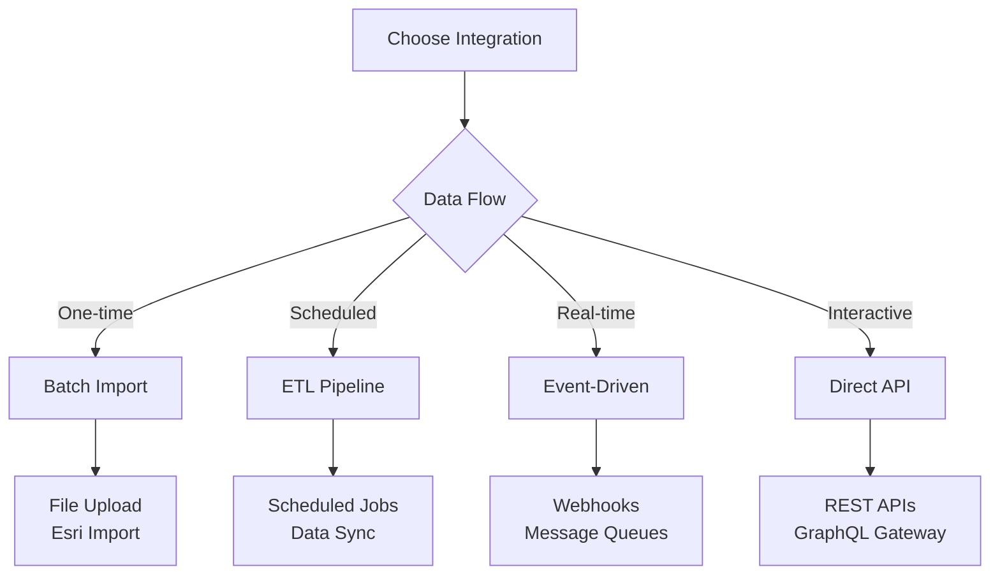

# Integration Patterns

This guide covers common patterns for integrating Honua Server into existing applications, workflows, and data architectures.

## 🎯 **Integration Decision Matrix**

| Pattern | Use Case | Complexity | Best Protocol | Benefits |
|---------|----------|------------|---------------|----------|
| **Direct API** | Simple CRUD operations | Low | OGC API Features | Standards-compliant, simple |
| **SDK Wrapper** | Application integration | Medium | Multiple protocols | Type safety, error handling |
| **ETL Pipeline** | Data synchronization | Medium | OData v4 + FeatureServer | Batch processing, scheduling |
| **Event-Driven** | Real-time updates | High | Webhooks + API | Reactive, scalable |
| **Microservice** | Service architecture | High | All protocols | Decoupled, fault-tolerant |



*📸 Placeholder: Interactive integration pattern selector*

---

## 🔌 **Pattern 1: Direct API Integration**

**Best for**: Simple applications, prototyping, direct client access
**Complexity**: Low
**Protocols**: OGC API Features (recommended), FeatureServer REST

### **Frontend Web Application**

**React with OGC API Features:**
```javascript
// hooks/useHonuaFeatures.js
import { useState, useEffect } from 'react';

export function useHonuaFeatures(collectionId, filters = {}) {
  const [features, setFeatures] = useState([]);
  const [loading, setLoading] = useState(false);
  const [error, setError] = useState(null);

  const fetchFeatures = async (newFilters = {}) => {
    setLoading(true);
    setError(null);

    try {
      const params = new URLSearchParams({
        limit: filters.limit || 100,
        ...newFilters
      });

      if (filters.bbox) {
        params.append('bbox', filters.bbox.join(','));
      }

      if (filters.cqlFilter) {
        params.append('filter', filters.cqlFilter);
        params.append('filter-lang', 'cql2-text');
      }

      const response = await fetch(
        `${process.env.REACT_APP_HONUA_URL}/ogc/features/collections/${collectionId}/items?${params}`
      );

      if (!response.ok) {
        throw new Error(`HTTP ${response.status}: ${response.statusText}`);
      }

      const data = await response.json();
      setFeatures(data.features);
    } catch (err) {
      setError(err.message);
    } finally {
      setLoading(false);
    }
  };

  const createFeature = async (geoJsonFeature) => {
    try {
      const response = await fetch(
        `${process.env.REACT_APP_HONUA_URL}/ogc/features/collections/${collectionId}/items`,
        {
          method: 'POST',
          headers: {
            'Content-Type': 'application/geo+json',
            'Authorization': `Bearer ${getAuthToken()}`
          },
          body: JSON.stringify(geoJsonFeature)
        }
      );

      if (!response.ok) {
        throw new Error(`Create failed: ${response.statusText}`);
      }

      const newFeature = await response.json();
      setFeatures(prev => [...prev, newFeature]);
      return newFeature;
    } catch (err) {
      setError(err.message);
      throw err;
    }
  };

  const updateFeature = async (featureId, geoJsonFeature) => {
    try {
      const response = await fetch(
        `${process.env.REACT_APP_HONUA_URL}/ogc/features/collections/${collectionId}/items/${featureId}`,
        {
          method: 'PUT',
          headers: {
            'Content-Type': 'application/geo+json',
            'Authorization': `Bearer ${getAuthToken()}`
          },
          body: JSON.stringify(geoJsonFeature)
        }
      );

      if (!response.ok) {
        throw new Error(`Update failed: ${response.statusText}`);
      }

      const updatedFeature = await response.json();
      setFeatures(prev => prev.map(f =>
        f.id === featureId ? updatedFeature : f
      ));
      return updatedFeature;
    } catch (err) {
      setError(err.message);
      throw err;
    }
  };

  const deleteFeature = async (featureId) => {
    try {
      const response = await fetch(
        `${process.env.REACT_APP_HONUA_URL}/ogc/features/collections/${collectionId}/items/${featureId}`,
        {
          method: 'DELETE',
          headers: {
            'Authorization': `Bearer ${getAuthToken()}`
          }
        }
      );

      if (!response.ok) {
        throw new Error(`Delete failed: ${response.statusText}`);
      }

      setFeatures(prev => prev.filter(f => f.id !== featureId));
    } catch (err) {
      setError(err.message);
      throw err;
    }
  };

  useEffect(() => {
    fetchFeatures();
  }, [collectionId]);

  return {
    features,
    loading,
    error,
    refetch: fetchFeatures,
    createFeature,
    updateFeature,
    deleteFeature
  };
}
```

**Component Usage:**
```javascript
// components/FeatureMap.jsx
import React from 'react';
import { useHonuaFeatures } from '../hooks/useHonuaFeatures';
import MapLibreGL from 'maplibre-gl';

function FeatureMap({ collectionId, bbox }) {
  const {
    features,
    loading,
    error,
    createFeature,
    updateFeature,
    deleteFeature
  } = useHonuaFeatures(collectionId, {
    bbox,
    cqlFilter: "status = 'active'",
    limit: 1000
  });

  const handleMapClick = async (lngLat) => {
    const newFeature = {
      type: 'Feature',
      geometry: {
        type: 'Point',
        coordinates: [lngLat.lng, lngLat.lat]
      },
      properties: {
        name: 'New Feature',
        status: 'active',
        created_at: new Date().toISOString()
      }
    };

    try {
      await createFeature(newFeature);
      console.log('Feature created successfully');
    } catch (error) {
      console.error('Failed to create feature:', error);
    }
  };

  if (loading) return <div>Loading features...</div>;
  if (error) return <div>Error: {error}</div>;

  return (
    <div>
      <div>Found {features.length} features</div>
      {/* MapLibre integration here */}
    </div>
  );
}
```

### **Mobile Application**

**React Native with Expo:**
```javascript
// services/HonuaService.js
import AsyncStorage from '@react-native-async-storage/async-storage';

class HonuaService {
  constructor(baseUrl) {
    this.baseUrl = baseUrl;
  }

  async makeRequest(endpoint, options = {}) {
    const token = await AsyncStorage.getItem('auth_token');

    const config = {
      headers: {
        'Content-Type': 'application/json',
        ...(token && { 'Authorization': `Bearer ${token}` }),
        ...options.headers
      },
      ...options
    };

    const response = await fetch(`${this.baseUrl}${endpoint}`, config);

    if (!response.ok) {
      throw new Error(`API Error: ${response.status}`);
    }

    return response.json();
  }

  // Offline-first feature management
  async getFeaturesOfflineFirst(collectionId, bbox) {
    const cacheKey = `features_${collectionId}_${bbox.join('_')}`;

    try {
      // Try to fetch fresh data
      const features = await this.makeRequest(
        `/ogc/features/collections/${collectionId}/items?bbox=${bbox.join(',')}`
      );

      // Cache the results
      await AsyncStorage.setItem(cacheKey, JSON.stringify(features));
      return features;
    } catch (error) {
      // Fall back to cached data
      console.warn('Network failed, using cached data:', error);
      const cached = await AsyncStorage.getItem(cacheKey);
      return cached ? JSON.parse(cached) : { features: [] };
    }
  }

  // Queue operations for later sync
  async queueOperation(operation) {
    const queue = await this.getOperationQueue();
    queue.push({
      ...operation,
      id: Date.now().toString(),
      timestamp: new Date().toISOString()
    });
    await AsyncStorage.setItem('operation_queue', JSON.stringify(queue));
  }

  async getOperationQueue() {
    const queue = await AsyncStorage.getItem('operation_queue');
    return queue ? JSON.parse(queue) : [];
  }

  // Sync queued operations when online
  async syncOperations() {
    const queue = await this.getOperationQueue();
    const successful = [];
    const failed = [];

    for (const operation of queue) {
      try {
        switch (operation.type) {
          case 'create':
            await this.makeRequest(
              `/ogc/features/collections/${operation.collectionId}/items`,
              {
                method: 'POST',
                body: JSON.stringify(operation.feature)
              }
            );
            break;
          case 'update':
            await this.makeRequest(
              `/ogc/features/collections/${operation.collectionId}/items/${operation.featureId}`,
              {
                method: 'PUT',
                body: JSON.stringify(operation.feature)
              }
            );
            break;
          case 'delete':
            await this.makeRequest(
              `/ogc/features/collections/${operation.collectionId}/items/${operation.featureId}`,
              { method: 'DELETE' }
            );
            break;
        }
        successful.push(operation);
      } catch (error) {
        console.error(`Failed to sync operation ${operation.id}:`, error);
        failed.push(operation);
      }
    }

    // Update queue with only failed operations
    await AsyncStorage.setItem('operation_queue', JSON.stringify(failed));

    return { successful: successful.length, failed: failed.length };
  }
}

export default new HonuaService(process.env.EXPO_PUBLIC_HONUA_URL);
```

*📸 Placeholder: Mobile app screenshot showing offline-first geospatial data*

---

## 🔄 **Pattern 2: SDK/Client Library Pattern**

**Best for**: Type-safe integrations, multiple protocol support, reusable components
**Complexity**: Medium
**Protocols**: All protocols with unified interface

### **TypeScript SDK**

```typescript
// src/HonuaClient.ts
export interface HonuaClientOptions {
  baseUrl: string;
  apiKey?: string;
  timeout?: number;
  retryConfig?: {
    maxRetries: number;
    retryDelay: number;
  };
}

export interface Feature {
  id: string;
  type: 'Feature';
  geometry: GeoJSON.Geometry;
  properties: Record<string, any>;
}

export interface QueryOptions {
  bbox?: [number, number, number, number];
  limit?: number;
  offset?: number;
  filter?: string;
  orderBy?: string[];
}

export class HonuaClient {
  private readonly http: HttpClient;
  private readonly baseUrl: string;

  constructor(options: HonuaClientOptions) {
    this.baseUrl = options.baseUrl;
    this.http = new HttpClient({
      timeout: options.timeout || 30000,
      retryConfig: options.retryConfig || { maxRetries: 3, retryDelay: 1000 },
      defaultHeaders: {
        ...(options.apiKey && { 'X-API-Key': options.apiKey })
      }
    });
  }

  // OGC API Features interface
  async getCollections(): Promise<CollectionInfo[]> {
    const response = await this.http.get<CollectionsResponse>(
      `${this.baseUrl}/ogc/features/collections`
    );
    return response.collections;
  }

  async getFeatures(collectionId: string, options: QueryOptions = {}): Promise<Feature[]> {
    const params = new URLSearchParams();

    if (options.bbox) params.append('bbox', options.bbox.join(','));
    if (options.limit) params.append('limit', options.limit.toString());
    if (options.offset) params.append('offset', options.offset.toString());
    if (options.filter) {
      params.append('filter', options.filter);
      params.append('filter-lang', 'cql2-text');
    }

    const response = await this.http.get<FeatureCollection>(
      `${this.baseUrl}/ogc/features/collections/${collectionId}/items?${params}`
    );

    return response.features;
  }

  async createFeature(collectionId: string, feature: Omit<Feature, 'id'>): Promise<Feature> {
    return this.http.post<Feature>(
      `${this.baseUrl}/ogc/features/collections/${collectionId}/items`,
      feature,
      { headers: { 'Content-Type': 'application/geo+json' } }
    );
  }

  async updateFeature(collectionId: string, featureId: string, feature: Feature): Promise<Feature> {
    return this.http.put<Feature>(
      `${this.baseUrl}/ogc/features/collections/${collectionId}/items/${featureId}`,
      feature,
      { headers: { 'Content-Type': 'application/geo+json' } }
    );
  }

  async deleteFeature(collectionId: string, featureId: string): Promise<void> {
    await this.http.delete(
      `${this.baseUrl}/ogc/features/collections/${collectionId}/items/${featureId}`
    );
  }

  // OData interface for analytics
  async queryOData(query: string): Promise<any[]> {
    const response = await this.http.get<ODataResponse>(
      `${this.baseUrl}/odata/Features?${query}`
    );
    return response.value;
  }

  // High-level convenience methods
  async searchByAttributes(collectionId: string, searchTerm: string): Promise<Feature[]> {
    return this.getFeatures(collectionId, {
      filter: `name ILIKE '%${searchTerm}%' OR description ILIKE '%${searchTerm}%'`,
      limit: 100
    });
  }

  async getFeaturesInBounds(
    collectionId: string,
    bounds: [number, number, number, number]
  ): Promise<Feature[]> {
    return this.getFeatures(collectionId, {
      bbox: bounds,
      limit: 1000
    });
  }

  async getFeaturesNearPoint(
    collectionId: string,
    point: [number, number],
    radiusMeters: number
  ): Promise<Feature[]> {
    return this.getFeatures(collectionId, {
      filter: `ST_DWithin(geometry, ST_Point(${point[0]}, ${point[1]}), ${radiusMeters})`
    });
  }

  // Batch operations
  async batchCreate(collectionId: string, features: Omit<Feature, 'id'>[]): Promise<Feature[]> {
    return this.http.post<Feature[]>(
      `${this.baseUrl}/ogc/features/collections/${collectionId}/items/batch`,
      { creates: features }
    );
  }

  async batchUpdate(collectionId: string, updates: { id: string; feature: Feature }[]): Promise<void> {
    await this.http.post(
      `${this.baseUrl}/ogc/features/collections/${collectionId}/items/batch`,
      { updates }
    );
  }

  // Streaming for large datasets
  async *streamFeatures(collectionId: string, options: QueryOptions = {}): AsyncGenerator<Feature> {
    const batchSize = options.limit || 1000;
    let offset = options.offset || 0;

    while (true) {
      const batch = await this.getFeatures(collectionId, {
        ...options,
        limit: batchSize,
        offset
      });

      if (batch.length === 0) break;

      for (const feature of batch) {
        yield feature;
      }

      if (batch.length < batchSize) break;
      offset += batchSize;
    }
  }
}

// HTTP client with retry and error handling
class HttpClient {
  private options: Required<Pick<HonuaClientOptions, 'timeout' | 'retryConfig'>> & {
    defaultHeaders: Record<string, string>;
  };

  constructor(options: any) {
    this.options = options;
  }

  async get<T>(url: string, config?: RequestInit): Promise<T> {
    return this.request<T>(url, { method: 'GET', ...config });
  }

  async post<T>(url: string, data?: any, config?: RequestInit): Promise<T> {
    return this.request<T>(url, {
      method: 'POST',
      body: data ? JSON.stringify(data) : undefined,
      ...config
    });
  }

  async put<T>(url: string, data: any, config?: RequestInit): Promise<T> {
    return this.request<T>(url, {
      method: 'PUT',
      body: JSON.stringify(data),
      ...config
    });
  }

  async delete(url: string, config?: RequestInit): Promise<void> {
    await this.request(url, { method: 'DELETE', ...config });
  }

  private async request<T>(url: string, config: RequestInit): Promise<T> {
    const { maxRetries, retryDelay } = this.options.retryConfig;

    for (let attempt = 0; attempt <= maxRetries; attempt++) {
      try {
        const response = await fetch(url, {
          ...config,
          headers: {
            'Content-Type': 'application/json',
            ...this.options.defaultHeaders,
            ...config.headers
          },
          signal: AbortSignal.timeout(this.options.timeout)
        });

        if (!response.ok) {
          const error = await this.parseErrorResponse(response);
          throw new HonuaApiError(response.status, error.message, error.details);
        }

        // Handle empty responses
        const text = await response.text();
        return text ? JSON.parse(text) : null;

      } catch (error) {
        if (attempt === maxRetries || !this.isRetryableError(error)) {
          throw error;
        }

        await this.delay(retryDelay * Math.pow(2, attempt));
      }
    }

    throw new Error('Max retries exceeded');
  }

  private async parseErrorResponse(response: Response) {
    try {
      return await response.json();
    } catch {
      return { message: response.statusText, details: null };
    }
  }

  private isRetryableError(error: any): boolean {
    if (error instanceof HonuaApiError) {
      return error.status >= 500 || error.status === 429;
    }
    return true; // Retry network errors
  }

  private delay(ms: number): Promise<void> {
    return new Promise(resolve => setTimeout(resolve, ms));
  }
}

export class HonuaApiError extends Error {
  constructor(
    public readonly status: number,
    message: string,
    public readonly details?: any
  ) {
    super(message);
    this.name = 'HonuaApiError';
  }
}
```

**Usage Example:**
```typescript
// app.ts
import { HonuaClient } from './HonuaClient';

const client = new HonuaClient({
  baseUrl: 'https://gis.company.com',
  apiKey: process.env.HONUA_API_KEY,
  timeout: 10000,
  retryConfig: { maxRetries: 3, retryDelay: 1000 }
});

async function demonstrateUsage() {
  try {
    // Get all collections
    const collections = await client.getCollections();
    console.log('Available collections:', collections.map(c => c.id));

    // Search for features
    const searchResults = await client.searchByAttributes('properties', 'restaurant');
    console.log(`Found ${searchResults.length} restaurants`);

    // Spatial query
    const nearbyFeatures = await client.getFeaturesNearPoint(
      'properties',
      [-122.4194, 37.7749], // San Francisco
      1000 // 1km radius
    );

    // Batch operations
    const newFeatures = await client.batchCreate('properties', [
      {
        type: 'Feature',
        geometry: { type: 'Point', coordinates: [-122.42, 37.77] },
        properties: { name: 'New Restaurant', type: 'restaurant' }
      }
    ]);

    // Stream large datasets
    for await (const feature of client.streamFeatures('properties', { limit: 10000 })) {
      console.log(`Processing feature: ${feature.properties.name}`);
      // Process each feature without loading all into memory
    }

  } catch (error) {
    if (error instanceof HonuaApiError) {
      console.error(`API Error ${error.status}: ${error.message}`, error.details);
    } else {
      console.error('Network Error:', error);
    }
  }
}
```

*📸 Placeholder: IDE screenshot showing TypeScript SDK with autocomplete*

---

## 📊 **Pattern 3: ETL Pipeline Integration**

**Best for**: Data synchronization, scheduled workflows, batch processing
**Complexity**: Medium
**Protocols**: OData v4 (query), FeatureServer (write), Admin API (management)

### **Apache Airflow Pipeline**

```python
# dags/honua_sync_pipeline.py
from airflow import DAG
from airflow.operators.python import PythonOperator
from airflow.providers.postgres.operators.postgres import PostgresOperator
from airflow.providers.http.sensors.http import HttpSensor
from datetime import datetime, timedelta
import requests
import pandas as pd
from typing import List, Dict

default_args = {
    'owner': 'data-team',
    'depends_on_past': False,
    'start_date': datetime(2024, 1, 1),
    'email_on_failure': True,
    'email_on_retry': False,
    'retries': 2,
    'retry_delay': timedelta(minutes=5)
}

dag = DAG(
    'honua_data_sync',
    default_args=default_args,
    description='Sync data between systems and Honua',
    schedule_interval=timedelta(hours=1),
    catchup=False,
    tags=['honua', 'etl', 'geospatial']
)

class HonuaETLClient:
    def __init__(self, base_url: str, api_key: str):
        self.base_url = base_url
        self.session = requests.Session()
        self.session.headers.update({
            'X-API-Key': api_key,
            'Content-Type': 'application/json'
        })

    def extract_from_source_system(self, source_config: Dict) -> pd.DataFrame:
        """Extract data from source system (CRM, ERP, etc.)"""
        if source_config['type'] == 'salesforce':
            return self.extract_from_salesforce(source_config)
        elif source_config['type'] == 'database':
            return self.extract_from_database(source_config)
        else:
            raise ValueError(f"Unsupported source type: {source_config['type']}")

    def extract_from_salesforce(self, config: Dict) -> pd.DataFrame:
        """Extract accounts with addresses from Salesforce"""
        # Simplified Salesforce extraction
        sf_data = [
            {
                'id': 'SF001',
                'name': 'ACME Corp',
                'address': '123 Main St, San Francisco, CA',
                'latitude': 37.7749,
                'longitude': -122.4194,
                'industry': 'Technology',
                'revenue': 1000000
            }
            # ... more records
        ]
        return pd.DataFrame(sf_data)

    def transform_to_geojson(self, df: pd.DataFrame) -> List[Dict]:
        """Transform tabular data to GeoJSON features"""
        features = []

        for _, row in df.iterrows():
            if pd.notna(row['latitude']) and pd.notna(row['longitude']):
                feature = {
                    'type': 'Feature',
                    'geometry': {
                        'type': 'Point',
                        'coordinates': [float(row['longitude']), float(row['latitude'])]
                    },
                    'properties': {
                        'source_id': str(row['id']),
                        'name': row['name'],
                        'industry': row.get('industry'),
                        'revenue': float(row['revenue']) if pd.notna(row['revenue']) else None,
                        'last_updated': datetime.utcnow().isoformat()
                    }
                }
                features.append(feature)

        return features

    def upsert_features(self, collection_id: str, features: List[Dict]) -> Dict:
        """Upsert features using batch operations"""
        # First, get existing features to determine create vs update
        existing_response = self.session.get(
            f"{self.base_url}/ogc/features/collections/{collection_id}/items",
            params={'limit': 10000}  # Adjust based on data size
        )
        existing_response.raise_for_status()
        existing_features = {
            f['properties']['source_id']: f['id']
            for f in existing_response.json()['features']
            if 'source_id' in f['properties']
        }

        creates = []
        updates = []

        for feature in features:
            source_id = feature['properties']['source_id']
            if source_id in existing_features:
                # Update existing feature
                feature['id'] = existing_features[source_id]
                updates.append(feature)
            else:
                # Create new feature
                creates.append(feature)

        # Batch operations
        results = {'created': 0, 'updated': 0, 'errors': []}

        if creates:
            try:
                create_response = self.session.post(
                    f"{self.base_url}/ogc/features/collections/{collection_id}/items/batch",
                    json={'creates': creates}
                )
                create_response.raise_for_status()
                results['created'] = len(creates)
            except requests.exceptions.RequestException as e:
                results['errors'].append(f"Batch create failed: {e}")

        if updates:
            try:
                update_response = self.session.post(
                    f"{self.base_url}/ogc/features/collections/{collection_id}/items/batch",
                    json={'updates': updates}
                )
                update_response.raise_for_status()
                results['updated'] = len(updates)
            except requests.exceptions.RequestException as e:
                results['errors'].append(f"Batch update failed: {e}")

        return results

def extract_source_data(**context):
    """Extract data from source system"""
    client = HonuaETLClient(
        base_url=Variable.get("HONUA_BASE_URL"),
        api_key=Variable.get("HONUA_API_KEY")
    )

    source_config = {
        'type': 'salesforce',
        'connection_id': 'salesforce_default'
    }

    df = client.extract_from_source_system(source_config)

    # Store in XCom for next task
    return df.to_json(orient='records')

def transform_and_load(**context):
    """Transform data and load into Honua"""
    client = HonuaETLClient(
        base_url=Variable.get("HONUA_BASE_URL"),
        api_key=Variable.get("HONUA_API_KEY")
    )

    # Get data from previous task
    raw_data = context['task_instance'].xcom_pull(task_ids='extract_source_data')
    df = pd.read_json(raw_data)

    # Transform to GeoJSON
    features = client.transform_to_geojson(df)

    # Load into Honua
    results = client.upsert_features('customer_locations', features)

    print(f"ETL Results: {results}")

    # Log metrics
    if results['errors']:
        raise ValueError(f"ETL completed with errors: {results['errors']}")

    return results

def validate_data_quality(**context):
    """Validate data quality after ETL"""
    client = HonuaETLClient(
        base_url=Variable.get("HONUA_BASE_URL"),
        api_key=Variable.get("HONUA_API_KEY")
    )

    # Run data quality checks
    response = client.session.get(
        f"{client.base_url}/odata/Features",
        params={
            '$filter': "LayerId eq 'customer_locations'",
            '$select': 'id,properties',
            '$top': 1000
        }
    )

    features = response.json()['value']

    # Quality checks
    quality_issues = []

    # Check for required fields
    for feature in features:
        props = feature.get('properties', {})
        if not props.get('name'):
            quality_issues.append(f"Feature {feature['id']} missing name")
        if not props.get('source_id'):
            quality_issues.append(f"Feature {feature['id']} missing source_id")

    # Check for duplicates
    source_ids = [f['properties'].get('source_id') for f in features]
    duplicates = [sid for sid in set(source_ids) if source_ids.count(sid) > 1]
    if duplicates:
        quality_issues.extend([f"Duplicate source_id: {sid}" for sid in duplicates])

    if quality_issues:
        # Send alert but don't fail
        print(f"Data quality issues found: {quality_issues}")
        # Could send to monitoring system here

    return len(quality_issues)

# Define tasks
health_check = HttpSensor(
    task_id='health_check',
    http_conn_id='honua_default',
    endpoint='/healthz/ready',
    timeout=60,
    dag=dag
)

extract_task = PythonOperator(
    task_id='extract_source_data',
    python_callable=extract_source_data,
    dag=dag
)

transform_load_task = PythonOperator(
    task_id='transform_and_load',
    python_callable=transform_and_load,
    dag=dag
)

validate_task = PythonOperator(
    task_id='validate_data_quality',
    python_callable=validate_data_quality,
    dag=dag
)

# Update statistics
update_stats_task = PostgresOperator(
    task_id='update_statistics',
    postgres_conn_id='honua_db',
    sql="""
        INSERT INTO etl_statistics (
            pipeline_name,
            run_date,
            records_processed,
            success
        ) VALUES (
            'honua_data_sync',
            '{{ ds }}',
            {{ ti.xcom_pull(task_ids='transform_and_load')['created'] + ti.xcom_pull(task_ids='transform_and_load')['updated'] }},
            true
        )
    """,
    dag=dag
)

# Set task dependencies
health_check >> extract_task >> transform_load_task >> validate_task >> update_stats_task
```

### **Azure Data Factory Pipeline**

```json
{
  "name": "HonuaDataSync",
  "properties": {
    "description": "Sync data from various sources to Honua Server",
    "activities": [
      {
        "name": "ExtractFromSQL",
        "type": "Copy",
        "inputs": [
          {
            "referenceName": "SourceSQLDataset",
            "type": "DatasetReference"
          }
        ],
        "outputs": [
          {
            "referenceName": "StagingBlobDataset",
            "type": "DatasetReference"
          }
        ],
        "typeProperties": {
          "source": {
            "type": "SqlSource",
            "sqlReaderQuery": "SELECT id, name, address, lat, lng, category, updated_at FROM locations WHERE updated_at > '@{adddays(utcnow(), -1)}'"
          },
          "sink": {
            "type": "BlobSink",
            "writeBatchSize": 1000
          }
        }
      },
      {
        "name": "TransformToGeoJSON",
        "type": "ExecuteDataFlow",
        "dependsOn": [
          {
            "activity": "ExtractFromSQL",
            "dependencyConditions": ["Succeeded"]
          }
        ],
        "typeProperties": {
          "dataflow": {
            "referenceName": "TransformToGeoJSONFlow",
            "type": "DataFlowReference"
          }
        }
      },
      {
        "name": "LoadToHonua",
        "type": "WebActivity",
        "dependsOn": [
          {
            "activity": "TransformToGeoJSON",
            "dependencyConditions": ["Succeeded"]
          }
        ],
        "typeProperties": {
          "url": "@pipeline().globalParameters.HonuaBaseUrl/api/v1/admin/import/batch",
          "method": "POST",
          "headers": {
            "Content-Type": "application/json",
            "X-API-Key": "@pipeline().globalParameters.HonuaApiKey"
          },
          "body": {
            "layerId": "locations",
            "features": "@activity('TransformToGeoJSON').output.features",
            "upsertMode": true
          }
        }
      }
    ]
  }
}
```

*📸 Placeholder: Airflow DAG graph showing ETL pipeline flow*

---

## 🔔 **Pattern 4: Event-Driven Integration**

**Best for**: Real-time updates, reactive architectures, loose coupling
**Complexity**: High
**Protocols**: Webhooks + any protocol for data sync

### **Webhook + Message Queue Architecture**

```python
# webhook_handler.py
from fastapi import FastAPI, BackgroundTasks, HTTPException
from pydantic import BaseModel
from typing import Dict, Any, List
import asyncio
import aioredis
import json
from datetime import datetime

app = FastAPI(title="Honua Event Handler")

class WebhookEvent(BaseModel):
    event_type: str
    source_system: str
    entity_id: str
    entity_type: str
    data: Dict[str, Any]
    timestamp: datetime

class HonuaEventProcessor:
    def __init__(self, redis_url: str, honua_client: 'HonuaClient'):
        self.redis = None
        self.redis_url = redis_url
        self.honua = honua_client

    async def connect(self):
        self.redis = await aioredis.from_url(self.redis_url)

    async def process_event(self, event: WebhookEvent):
        """Process incoming webhook event"""
        # Add to processing queue
        await self.redis.lpush(
            f"events:{event.source_system}",
            json.dumps(event.dict())
        )

        # Process immediately for critical events
        if event.event_type in ['create', 'update', 'delete']:
            await self.handle_crud_event(event)

    async def handle_crud_event(self, event: WebhookEvent):
        """Handle CRUD events with immediate processing"""
        try:
            if event.entity_type == 'location':
                await self.sync_location(event)
            elif event.entity_type == 'property':
                await self.sync_property(event)
            else:
                print(f"Unknown entity type: {event.entity_type}")

        except Exception as e:
            # Add to dead letter queue for manual review
            await self.redis.lpush(
                "dead_letter_queue",
                json.dumps({
                    "event": event.dict(),
                    "error": str(e),
                    "failed_at": datetime.utcnow().isoformat()
                })
            )
            raise

    async def sync_location(self, event: WebhookEvent):
        """Sync location data to Honua"""
        data = event.data

        # Transform to GeoJSON
        geojson_feature = {
            "type": "Feature",
            "geometry": {
                "type": "Point",
                "coordinates": [data.get("longitude"), data.get("latitude")]
            },
            "properties": {
                "source_id": event.entity_id,
                "source_system": event.source_system,
                "name": data.get("name"),
                "address": data.get("address"),
                "category": data.get("category"),
                "updated_at": event.timestamp.isoformat()
            }
        }

        collection_id = f"{event.source_system}_locations"

        if event.event_type == 'create':
            await self.honua.createFeature(collection_id, geojson_feature)
        elif event.event_type == 'update':
            # Find existing feature by source_id
            existing = await self.honua.getFeatures(
                collection_id,
                {"filter": f"source_id = '{event.entity_id}'"}
            )
            if existing:
                geojson_feature['id'] = existing[0]['id']
                await self.honua.updateFeature(collection_id, existing[0]['id'], geojson_feature)
            else:
                # Create if not found
                await self.honua.createFeature(collection_id, geojson_feature)
        elif event.event_type == 'delete':
            existing = await self.honua.getFeatures(
                collection_id,
                {"filter": f"source_id = '{event.entity_id}'"}
            )
            if existing:
                await self.honua.deleteFeature(collection_id, existing[0]['id'])

# Initialize processor
processor = HonuaEventProcessor(
    redis_url="redis://localhost:6379",
    honua_client=HonuaClient({"baseUrl": "http://localhost:8080"})
)

@app.on_event("startup")
async def startup():
    await processor.connect()

@app.post("/webhook/{source_system}")
async def handle_webhook(
    source_system: str,
    event: WebhookEvent,
    background_tasks: BackgroundTasks
):
    """Handle incoming webhooks from various source systems"""
    event.source_system = source_system

    # Add to background processing
    background_tasks.add_task(processor.process_event, event)

    return {"status": "accepted", "event_id": f"{source_system}_{event.entity_id}_{int(event.timestamp.timestamp())}"}

@app.get("/health")
async def health_check():
    try:
        await processor.redis.ping()
        return {"status": "healthy", "redis": "connected"}
    except:
        return {"status": "unhealthy", "redis": "disconnected"}

# Background worker for batch processing
async def batch_worker():
    """Background worker to process events in batches"""
    while True:
        try:
            # Process events in batches for efficiency
            for source_system in ['salesforce', 'dynamics', 'custom_crm']:
                events_data = await processor.redis.lrange(f"events:{source_system}", 0, 99)
                if events_data:
                    events = [WebhookEvent(**json.loads(data)) for data in events_data]
                    await process_event_batch(events)
                    await processor.redis.ltrim(f"events:{source_system}", 100, -1)

            await asyncio.sleep(30)  # Process every 30 seconds
        except Exception as e:
            print(f"Batch worker error: {e}")
            await asyncio.sleep(60)  # Wait longer on error

async def process_event_batch(events: List[WebhookEvent]):
    """Process a batch of events efficiently"""
    # Group by collection and operation type
    batches = {}

    for event in events:
        collection_id = f"{event.source_system}_{event.entity_type}s"
        operation_key = f"{collection_id}_{event.event_type}"

        if operation_key not in batches:
            batches[operation_key] = []
        batches[operation_key].append(event)

    # Process each batch
    for operation_key, event_batch in batches.items():
        collection_id, operation = operation_key.rsplit('_', 1)

        if operation == 'create':
            features = [await transform_event_to_geojson(event) for event in event_batch]
            await processor.honua.batchCreate(collection_id, features)
        elif operation == 'update':
            # Handle updates (more complex due to lookup requirements)
            for event in event_batch:
                await processor.handle_crud_event(event)

async def transform_event_to_geojson(event: WebhookEvent) -> Dict:
    """Transform webhook event to GeoJSON feature"""
    data = event.data
    return {
        "type": "Feature",
        "geometry": {
            "type": "Point",
            "coordinates": [data.get("longitude"), data.get("latitude")]
        },
        "properties": {
            "source_id": event.entity_id,
            "source_system": event.source_system,
            **{k: v for k, v in data.items() if k not in ['longitude', 'latitude']}
        }
    }

if __name__ == "__main__":
    import uvicorn

    # Start background worker
    asyncio.create_task(batch_worker())

    # Start web server
    uvicorn.run(app, host="0.0.0.0", port=8000)
```

### **Kafka Event Processing**

```python
# kafka_consumer.py
from kafka import KafkaConsumer
import json
import asyncio
from typing import Dict, Any
from honua_client import HonuaClient

class HonuaKafkaProcessor:
    def __init__(self, kafka_bootstrap_servers: str, honua_base_url: str, api_key: str):
        self.consumer = KafkaConsumer(
            'location-updates',
            'property-changes',
            'user-activities',
            bootstrap_servers=kafka_bootstrap_servers,
            value_deserializer=lambda x: json.loads(x.decode('utf-8')),
            group_id='honua-sync-group',
            enable_auto_commit=True,
            auto_commit_interval_ms=1000,
            max_poll_records=100
        )

        self.honua = HonuaClient(base_url=honua_base_url, api_key=api_key)
        self.batch_size = 50
        self.batch_timeout = 30  # seconds

    async def start_processing(self):
        """Start processing Kafka messages"""
        batch = []
        last_batch_time = asyncio.get_event_loop().time()

        for message in self.consumer:
            batch.append(message)

            # Process batch when size limit reached or timeout exceeded
            current_time = asyncio.get_event_loop().time()
            should_process = (
                len(batch) >= self.batch_size or
                (current_time - last_batch_time) >= self.batch_timeout
            )

            if should_process and batch:
                await self.process_batch(batch)
                batch = []
                last_batch_time = current_time

    async def process_batch(self, messages):
        """Process a batch of Kafka messages"""
        # Group by topic and operation type
        operations = {
            'creates': [],
            'updates': [],
            'deletes': []
        }

        for message in messages:
            topic = message.topic
            event_data = message.value

            # Determine operation type from event
            operation_type = event_data.get('operation', 'create')
            collection_id = self.topic_to_collection(topic)

            if operation_type in operations:
                operations[operation_type].append({
                    'collection_id': collection_id,
                    'event_data': event_data
                })

        # Execute batch operations
        await asyncio.gather(
            self.process_creates(operations['creates']),
            self.process_updates(operations['updates']),
            self.process_deletes(operations['deletes'])
        )

    async def process_creates(self, creates):
        """Process batch create operations"""
        if not creates:
            return

        # Group by collection
        by_collection = {}
        for item in creates:
            collection_id = item['collection_id']
            if collection_id not in by_collection:
                by_collection[collection_id] = []
            by_collection[collection_id].append(item['event_data'])

        # Batch create for each collection
        for collection_id, events in by_collection.items():
            features = [self.transform_to_geojson(event) for event in events]
            try:
                await self.honua.batchCreate(collection_id, features)
                print(f"Created {len(features)} features in {collection_id}")
            except Exception as e:
                print(f"Batch create failed for {collection_id}: {e}")

    def topic_to_collection(self, topic: str) -> str:
        """Map Kafka topic to Honua collection"""
        mapping = {
            'location-updates': 'locations',
            'property-changes': 'properties',
            'user-activities': 'user_activities'
        }
        return mapping.get(topic, topic.replace('-', '_'))

    def transform_to_geojson(self, event_data: Dict[str, Any]) -> Dict[str, Any]:
        """Transform event data to GeoJSON feature"""
        coordinates = [event_data.get('longitude'), event_data.get('latitude')]

        return {
            "type": "Feature",
            "geometry": {
                "type": "Point",
                "coordinates": coordinates
            },
            "properties": {
                k: v for k, v in event_data.items()
                if k not in ['longitude', 'latitude', 'operation']
            }
        }

# Usage
async def main():
    processor = HonuaKafkaProcessor(
        kafka_bootstrap_servers='localhost:9092',
        honua_base_url='http://localhost:8080',
        api_key='your-api-key'
    )

    await processor.start_processing()

if __name__ == "__main__":
    asyncio.run(main())
```

*📸 Placeholder: Event-driven architecture diagram with message flows*

---

## 🏗️ **Pattern 5: Microservice Integration**

**Best for**: Service-oriented architectures, API gateways, complex distributed systems
**Complexity**: High
**Protocols**: All protocols via service mesh

### **GraphQL Gateway**

```typescript
// src/graphql/honua-resolver.ts
import { Resolver, Query, Mutation, Arg, ObjectType, Field, InputType } from 'type-graphql';
import { HonuaClient } from '../clients/HonuaClient';

@ObjectType()
class Feature {
  @Field()
  id: string;

  @Field()
  type: string;

  @Field(() => Geometry)
  geometry: Geometry;

  @Field(() => Properties)
  properties: Properties;
}

@ObjectType()
class Geometry {
  @Field()
  type: string;

  @Field(() => [Number])
  coordinates: number[];
}

@ObjectType()
class Properties {
  @Field({ nullable: true })
  name?: string;

  @Field({ nullable: true })
  description?: string;

  @Field(() => [String], { nullable: true })
  tags?: string[];

  @Field({ nullable: true })
  category?: string;
}

@InputType()
class FeatureInput {
  @Field(() => GeometryInput)
  geometry: GeometryInput;

  @Field(() => PropertiesInput)
  properties: PropertiesInput;
}

@InputType()
class GeometryInput {
  @Field()
  type: string;

  @Field(() => [Number])
  coordinates: number[];
}

@InputType()
class PropertiesInput {
  @Field({ nullable: true })
  name?: string;

  @Field({ nullable: true })
  description?: string;

  @Field(() => [String], { nullable: true })
  tags?: string[];

  @Field({ nullable: true })
  category?: string;
}

@InputType()
class BoundingBox {
  @Field()
  minLng: number;

  @Field()
  minLat: number;

  @Field()
  maxLng: number;

  @Field()
  maxLat: number;
}

@Resolver(Feature)
export class HonuaResolver {
  private honuaClient: HonuaClient;

  constructor() {
    this.honuaClient = new HonuaClient({
      baseUrl: process.env.HONUA_BASE_URL!,
      apiKey: process.env.HONUA_API_KEY
    });
  }

  @Query(() => [Feature])
  async features(
    @Arg('collectionId') collectionId: string,
    @Arg('bbox', { nullable: true }) bbox?: BoundingBox,
    @Arg('limit', { nullable: true, defaultValue: 100 }) limit?: number,
    @Arg('filter', { nullable: true }) filter?: string,
    @Arg('search', { nullable: true }) search?: string
  ): Promise<Feature[]> {
    const options: any = { limit };

    if (bbox) {
      options.bbox = [bbox.minLng, bbox.minLat, bbox.maxLng, bbox.maxLat];
    }

    if (filter) {
      options.filter = filter;
    }

    if (search) {
      options.filter = options.filter
        ? `${options.filter} AND (name ILIKE '%${search}%' OR description ILIKE '%${search}%')`
        : `name ILIKE '%${search}%' OR description ILIKE '%${search}%'`;
    }

    return this.honuaClient.getFeatures(collectionId, options);
  }

  @Query(() => Feature, { nullable: true })
  async feature(
    @Arg('collectionId') collectionId: string,
    @Arg('featureId') featureId: string
  ): Promise<Feature | null> {
    const features = await this.honuaClient.getFeatures(collectionId, {
      filter: `id = '${featureId}'`
    });
    return features[0] || null;
  }

  @Mutation(() => Feature)
  async createFeature(
    @Arg('collectionId') collectionId: string,
    @Arg('feature') feature: FeatureInput
  ): Promise<Feature> {
    const geoJsonFeature = {
      type: 'Feature' as const,
      geometry: feature.geometry,
      properties: feature.properties
    };

    return this.honuaClient.createFeature(collectionId, geoJsonFeature);
  }

  @Mutation(() => Feature)
  async updateFeature(
    @Arg('collectionId') collectionId: string,
    @Arg('featureId') featureId: string,
    @Arg('feature') feature: FeatureInput
  ): Promise<Feature> {
    const geoJsonFeature = {
      id: featureId,
      type: 'Feature' as const,
      geometry: feature.geometry,
      properties: feature.properties
    };

    return this.honuaClient.updateFeature(collectionId, featureId, geoJsonFeature);
  }

  @Mutation(() => Boolean)
  async deleteFeature(
    @Arg('collectionId') collectionId: string,
    @Arg('featureId') featureId: string
  ): Promise<boolean> {
    try {
      await this.honuaClient.deleteFeature(collectionId, featureId);
      return true;
    } catch (error) {
      console.error('Failed to delete feature:', error);
      return false;
    }
  }

  // Advanced queries
  @Query(() => [Feature])
  async featuresNearPoint(
    @Arg('collectionId') collectionId: string,
    @Arg('lng') lng: number,
    @Arg('lat') lat: number,
    @Arg('radiusMeters', { defaultValue: 1000 }) radiusMeters: number,
    @Arg('limit', { defaultValue: 50 }) limit: number
  ): Promise<Feature[]> {
    return this.honuaClient.getFeaturesNearPoint(
      collectionId,
      [lng, lat],
      radiusMeters,
      limit
    );
  }

  @Query(() => Number)
  async featuresCount(
    @Arg('collectionId') collectionId: string,
    @Arg('filter', { nullable: true }) filter?: string
  ): Promise<number> {
    const features = await this.honuaClient.getFeatures(collectionId, {
      filter,
      limit: 1 // We only need the count
    });

    // In a real implementation, you'd use a count endpoint
    return features.length;
  }
}
```

**GraphQL Queries Example:**
```graphql
# Query features in bounding box
query GetFeaturesInBounds($collectionId: String!, $bbox: BoundingBox!) {
  features(collectionId: $collectionId, bbox: $bbox) {
    id
    geometry {
      type
      coordinates
    }
    properties {
      name
      description
      category
    }
  }
}

# Search for features
query SearchFeatures($collectionId: String!, $search: String!) {
  features(collectionId: $collectionId, search: $search) {
    id
    properties {
      name
      description
    }
  }
}

# Create new feature
mutation CreateFeature($collectionId: String!, $feature: FeatureInput!) {
  createFeature(collectionId: $collectionId, feature: $feature) {
    id
    properties {
      name
    }
  }
}

# Find features near a point
query FeaturesNearPoint($collectionId: String!, $lng: Float!, $lat: Float!, $radius: Int) {
  featuresNearPoint(collectionId: $collectionId, lng: $lng, lat: $lat, radiusMeters: $radius) {
    id
    properties {
      name
      description
    }
    geometry {
      coordinates
    }
  }
}
```

*📸 Placeholder: GraphQL playground showing Honua schema exploration*

---

## 📝 **Integration Best Practices**

### **1. Error Handling and Resilience**
- Implement circuit breakers for external API calls
- Use exponential backoff for retries
- Graceful degradation with cached data
- Comprehensive logging and monitoring

### **2. Performance Optimization**
- Batch operations when possible
- Use appropriate pagination
- Implement client-side caching
- Consider using vector tiles for map displays

### **3. Security Considerations**
- Store API keys securely
- Use HTTPS for all communications
- Implement proper authentication flows
- Validate all input data

### **4. Monitoring and Observability**
- Track API response times and error rates
- Monitor data freshness and quality
- Set up alerts for integration failures
- Use distributed tracing for complex flows

---

## 🔗 **Related Documentation**

- [API Examples](API_EXAMPLES.md) - Detailed protocol examples
- [Standards APIs](STANDARDS_APIS.md) - Protocol capabilities overview
- [User Journeys](USER_JOURNEYS.md) - Role-based integration guides
- [Deployment Scenarios](../devops/DEPLOYMENT_SCENARIOS.md) - Infrastructure patterns

---
*Choose the integration pattern that best fits your architecture, data flow requirements, and operational constraints.*