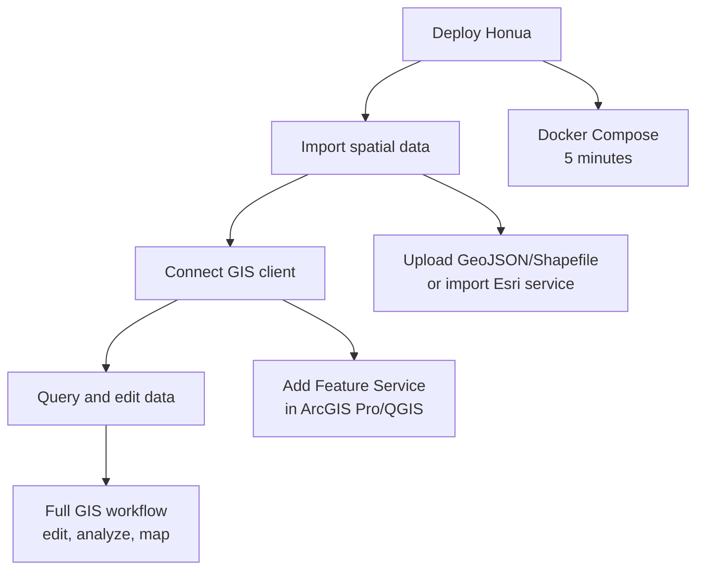
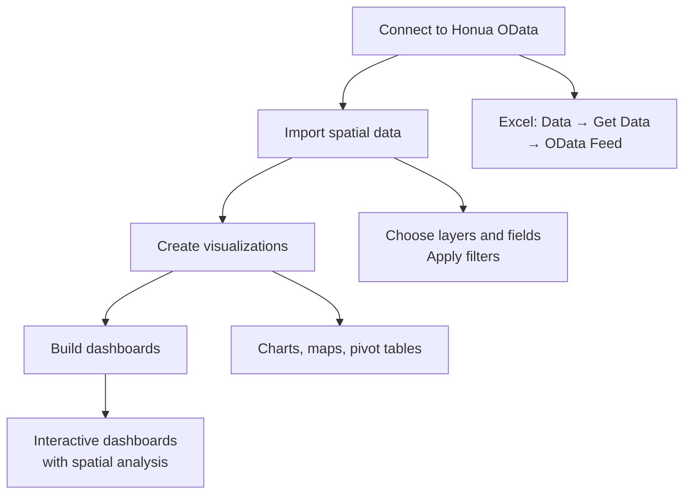
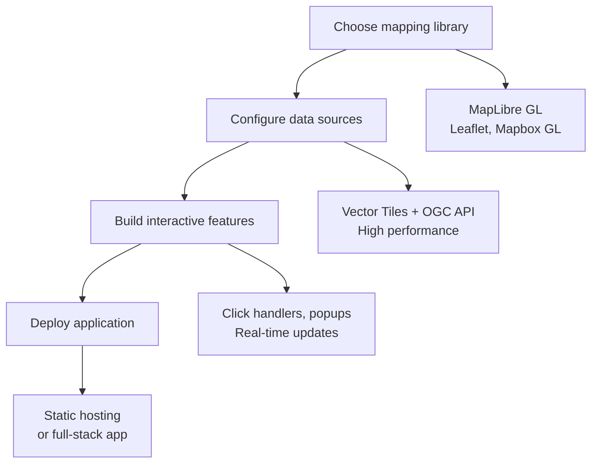
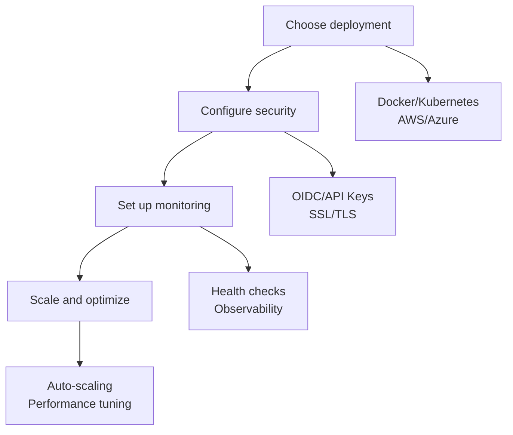
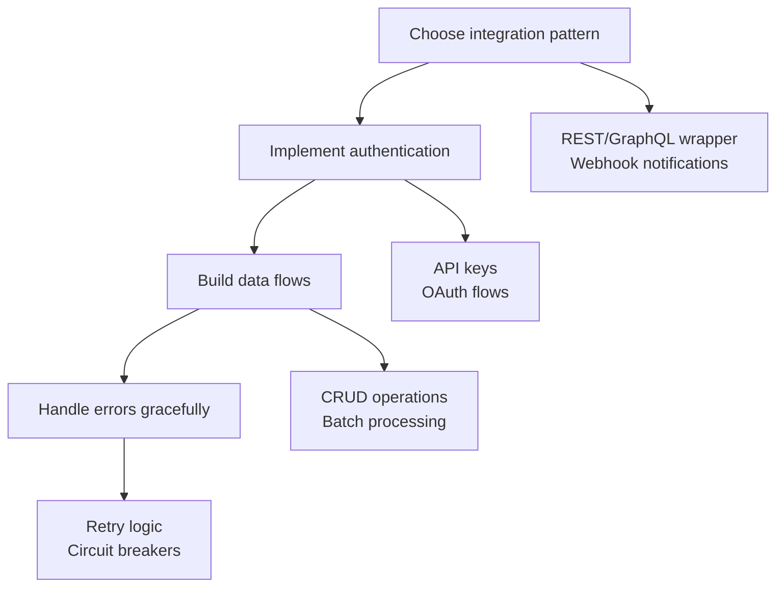

# User Journeys

Choose your path based on your role and what you want to accomplish with Honua Server.

## 🗺️ **GIS Professional Journey**

**Goal**: Connect ArcGIS Pro, QGIS, or other GIS desktop software to Honua data

### Quick Start Path


### **Step 1: Deploy Honua** ⚡ *5 minutes*
```bash
# Quick start with Docker
git clone https://github.com/honua-io/honua-server.git && cd honua-server
docker compose up -d
curl http://localhost:8080/healthz/ready  # ✅ Should return 200
```

### **Step 2: Add Your Data** 📊 *10 minutes*
Choose your data source:

**Option A: Upload Files**
- Navigate to Admin UI: `http://localhost:8080/admin`
- Go to Import → Upload GeoJSON, Shapefile, or GeoPackage
- *📸 Placeholder: File upload interface*

**Option B: Connect Existing Database**
- Add database connection in Admin UI
- Publish existing PostGIS tables as layers
- *📸 Placeholder: Database connection setup*

**Option C: Import Esri Service**
- Import from existing ArcGIS Server FeatureServer
- Preserves metadata and structure
- *📸 Placeholder: Esri service import wizard*

### **Step 3: Connect Your GIS Client** 🖥️ *2 minutes*

**ArcGIS Pro:**
1. Add Data → Feature Service
2. URL: `http://localhost:8080/rest/services/[service-id]/FeatureServer`
3. *📸 Placeholder: ArcGIS Pro Add Data dialog*

**QGIS:**
1. Layer → Add Layer → Add WFS Layer
2. URL: `http://localhost:8080/ogc/features`
3. *📸 Placeholder: QGIS WFS connection dialog*

### **Step 4: Work with Your Data** ✨
- ✅ Query with WHERE clauses and spatial filters
- ✅ Edit features (add, update, delete)
- ✅ Attach files to features
- ✅ Query related records
- ✅ Full offline sync capabilities

**Next Steps:**
- [FeatureServer API Examples](API_EXAMPLES.md#geoservices-rest-api)
- [OGC API Examples](API_EXAMPLES.md#ogc-api-features)

---

## 📊 **Data Analyst Journey**

**Goal**: Access spatial data in Excel, Power BI, Tableau, or other BI tools

### Quick Start Path


### **Step 1: Connect Excel to Honua** 📈 *3 minutes*
1. **Excel**: Data → Get Data → From Other Sources → From OData Feed
2. **URL**: `http://localhost:8080/odata`
3. **Navigate**: Choose Layers and Features collections
4. *📸 Placeholder: Excel Get Data wizard with OData*

### **Step 2: Power BI Connection** 📊 *5 minutes*
1. **Power BI Desktop**: Get Data → OData Feed
2. **URL**: `http://localhost:8080/odata`
3. **Query Editor**: Apply filters and transformations
4. *📸 Placeholder: Power BI OData connection*

### **Step 3: Spatial Analysis with OData** 🌐
```excel
// Excel: Filter features within distance
=FILTER(Features, geo.distance(Features[geometry], POINT(-122.4 37.8)) < 1000)

// Power BI: Spatial aggregation
Features
| where geo.intersects(geometry, POLYGON(...))
| summarize TotalValue = sum(value) by district
```

### **Advanced OData Queries**
- **$filter**: `population gt 10000 and geo.intersects(geometry, polygon)`
- **$search**: Full-text search across all attributes
- **$apply**: Aggregate and group by spatial regions
- **$expand**: Include related table data

**Example Dashboards:**
- Population density heatmaps
- Sales territory analysis
- Infrastructure asset management
- Environmental monitoring

**Next Steps:**
- [OData API Examples](API_EXAMPLES.md#odata-v4-api)
- [Data Modeling Guide](DATA_MODELING_GUIDE.md)

---

## 🌐 **Web Developer Journey**

**Goal**: Build interactive web maps and spatial web applications

### Quick Start Path


### **Step 1: High-Performance Vector Tiles** ⚡ *5 minutes*

**MapLibre GL Integration:**
```javascript
import maplibregl from 'maplibre-gl';

const map = new maplibregl.Map({
  container: 'map',
  style: {
    version: 8,
    sources: {
      'honua-data': {
        type: 'vector',
        tiles: ['http://localhost:8080/tiles/{layerId}/{z}/{x}/{y}.mvt']
      }
    },
    layers: [{
      id: 'features',
      type: 'fill',
      source: 'honua-data',
      'source-layer': 'features',
      paint: {
        'fill-color': '#3388ff',
        'fill-opacity': 0.6
      }
    }]
  }
});

// Add click handler for feature interaction
map.on('click', 'features', (e) => {
  const properties = e.features[0].properties;
  new maplibregl.Popup()
    .setLngLat(e.lngLat)
    .setHTML(`<h3>${properties.name}</h3><p>${properties.description}</p>`)
    .addTo(map);
});
```

*📸 Placeholder: Interactive web map with vector tiles*

### **Step 2: RESTful Data Access with OGC API** 🌍 *10 minutes*

**React Integration:**
```javascript
import React, { useState, useEffect } from 'react';

function FeaturesList({ bbox }) {
  const [features, setFeatures] = useState([]);

  useEffect(() => {
    const fetchFeatures = async () => {
      const response = await fetch(
        `http://localhost:8080/ogc/features/collections/layer1/items?bbox=${bbox}&limit=100`
      );
      const data = await response.json();
      setFeatures(data.features);
    };

    fetchFeatures();
  }, [bbox]);

  return (
    <div className="features-list">
      {features.map(feature => (
        <div key={feature.id} className="feature-card">
          <h3>{feature.properties.name}</h3>
          <p>{feature.properties.description}</p>
        </div>
      ))}
    </div>
  );
}
```

### **Step 3: Real-Time Data Updates** ⚡ *15 minutes*

**CRUD Operations:**
```javascript
// Create new feature
const createFeature = async (geoJsonFeature) => {
  const response = await fetch(
    'http://localhost:8080/ogc/features/collections/layer1/items',
    {
      method: 'POST',
      headers: { 'Content-Type': 'application/geo+json' },
      body: JSON.stringify(geoJsonFeature)
    }
  );
  return response.json();
};

// Update existing feature
const updateFeature = async (featureId, geoJsonFeature) => {
  const response = await fetch(
    `http://localhost:8080/ogc/features/collections/layer1/items/${featureId}`,
    {
      method: 'PUT',
      headers: { 'Content-Type': 'application/geo+json' },
      body: JSON.stringify(geoJsonFeature)
    }
  );
  return response.json();
};

// Delete feature
const deleteFeature = async (featureId) => {
  await fetch(
    `http://localhost:8080/ogc/features/collections/layer1/items/${featureId}`,
    { method: 'DELETE' }
  );
};
```

### **Step 4: Styling and Visualization** 🎨

**Dynamic Styling:**
```javascript
// Get auto-generated style for layer
const getLayerStyle = async (layerId) => {
  const response = await fetch(`http://localhost:8080/api/styles/${layerId}.json`);
  return response.json();
};

// Custom styling based on data
const createDataDrivenStyle = (layer) => ({
  id: layer.id,
  type: 'fill',
  source: 'honua-data',
  paint: {
    'fill-color': [
      'case',
      ['<', ['get', 'population'], 1000], '#ffffcc',
      ['<', ['get', 'population'], 5000], '#c2e699',
      ['<', ['get', 'population'], 10000], '#78c679',
      '#238443'
    ],
    'fill-opacity': 0.8
  }
});
```

*📸 Placeholder: Dynamic choropleth map with data-driven styling*

**Framework Integrations:**
- [CodePen Examples](https://codepen.io/collection/honua-examples) *(placeholder)*
- [React Starter](https://github.com/honua-io/react-starter) *(placeholder)*
- [Vue.js Components](https://github.com/honua-io/vue-components) *(placeholder)*

**Next Steps:**
- [Vector Tiles API](API_EXAMPLES.md#vector-tiles-mvt)
- [OGC API Features](API_EXAMPLES.md#ogc-api-features)
- [MapLibre Style Specification](https://maplibre.org/maplibre-style-spec/)

---

## ⚙️ **DevOps Engineer Journey**

**Goal**: Deploy, configure, and monitor Honua Server in production

### Quick Start Path


### **Step 1: Production Deployment** 🚀 *15 minutes*

**Kubernetes with Helm:**
```bash
# Add Honua Helm repository
helm repo add honua https://charts.honua.io

# Install with production configuration
helm install honua honua/honua \
  --set image.tag=latest \
  --set postgresql.enabled=true \
  --set redis.enabled=true \
  --set ingress.enabled=true \
  --set ingress.hosts[0].host=gis.yourcompany.com
```

**AWS ECS with Terraform:**
```hcl
module "honua" {
  source = "github.com/honua-io/terraform-aws-honua"

  cluster_name = "production"
  vpc_id       = var.vpc_id
  subnet_ids   = var.private_subnet_ids

  # Database configuration
  db_instance_class = "db.r5.large"
  db_allocated_storage = 100

  # Auto-scaling
  min_capacity = 2
  max_capacity = 10
}
```

*📸 Placeholder: Kubernetes dashboard showing Honua deployment*

### **Step 2: Security Configuration** 🔐 *20 minutes*

**OIDC Integration:**
```yaml
# values.yml for Helm
security:
  oidc:
    enabled: true
    authority: "https://login.microsoftonline.com/your-tenant-id"
    clientId: "your-client-id"
    clientSecret: "your-client-secret"

  # API key authentication for automation
  apiKey:
    enabled: true
    keys:
      - name: "monitoring"
        permissions: ["read:health", "read:metrics"]
      - name: "automation"
        permissions: ["write:admin"]
```

**SSL/TLS Setup:**
```bash
# Let's Encrypt with cert-manager
kubectl apply -f https://github.com/cert-manager/cert-manager/releases/download/v1.12.0/cert-manager.yaml

# Configure ingress with TLS
helm upgrade honua honua/honua \
  --set ingress.tls.enabled=true \
  --set ingress.tls.secretName=honua-tls \
  --set ingress.annotations."cert-manager\.io/cluster-issuer"=letsencrypt-prod
```

### **Step 3: Monitoring & Observability** 📊 *30 minutes*

**Prometheus + Grafana:**
```yaml
# monitoring.yml
apiVersion: v1
kind: ConfigMap
metadata:
  name: prometheus-config
data:
  prometheus.yml: |
    scrape_configs:
      - job_name: 'honua'
        static_configs:
          - targets: ['honua:8080']
        metrics_path: '/api/v1/metrics/prometheus'
        scrape_interval: 30s
```

**Key Metrics to Monitor:**
- Request rate and latency
- Database connection pool usage
- Memory and CPU utilization
- Cache hit rates
- Spatial query performance

*📸 Placeholder: Grafana dashboard with Honua metrics*

**Health Check Endpoints:**
```bash
# Kubernetes health checks
livenessProbe:
  httpGet:
    path: /healthz/live
    port: 8080
  initialDelaySeconds: 30
  periodSeconds: 10

readinessProbe:
  httpGet:
    path: /healthz/ready
    port: 8080
  initialDelaySeconds: 5
  periodSeconds: 5
```

### **Step 4: Performance Optimization** ⚡ *45 minutes*

**Database Tuning:**
```sql
-- PostGIS performance indexes
CREATE INDEX CONCURRENTLY idx_features_geom_gist ON features USING GIST (geometry);
CREATE INDEX CONCURRENTLY idx_features_attrs_gin ON features USING GIN (attributes);

-- Connection pooling
ALTER SYSTEM SET max_connections = 200;
ALTER SYSTEM SET shared_buffers = '256MB';
ALTER SYSTEM SET effective_cache_size = '1GB';
```

**Redis Caching:**
```yaml
redis:
  enabled: true
  cluster:
    enabled: true
    nodes: 3
  persistence:
    enabled: true
  resources:
    requests:
      memory: 512Mi
      cpu: 250m
```

**Auto-scaling Configuration:**
```yaml
autoscaling:
  enabled: true
  minReplicas: 2
  maxReplicas: 10
  targetCPUUtilizationPercentage: 70
  targetMemoryUtilizationPercentage: 80
```

**Next Steps:**
- [Deployment Scenarios](../devops/DEPLOYMENT_SCENARIOS.md) - Production deployment patterns
- [Performance Monitoring](../devops/performance-monitoring.md) - System monitoring setup
- [Performance Testing](../devops/performance-testing.md) - Load testing and optimization

---

## 🤖 **API Integration Developer Journey**

**Goal**: Integrate Honua APIs into existing applications and workflows

### Quick Start Path


### **Step 1: API Authentication** 🔑 *10 minutes*

**API Key Authentication:**
```python
import requests

class HonuaClient:
    def __init__(self, base_url, api_key):
        self.base_url = base_url
        self.session = requests.Session()
        self.session.headers.update({
            'X-API-Key': api_key,
            'Content-Type': 'application/json'
        })

    def get_features(self, collection_id, **params):
        response = self.session.get(
            f"{self.base_url}/ogc/features/collections/{collection_id}/items",
            params=params
        )
        response.raise_for_status()
        return response.json()
```

**OAuth 2.0 Integration:**
```javascript
import { AuthenticationProvider } from '@azure/msal-browser';

class HonuaAPIClient {
  constructor(baseUrl, authProvider) {
    this.baseUrl = baseUrl;
    this.authProvider = authProvider;
  }

  async request(endpoint, options = {}) {
    const token = await this.authProvider.getAccessToken();

    const response = await fetch(`${this.baseUrl}${endpoint}`, {
      ...options,
      headers: {
        'Authorization': `Bearer ${token}`,
        'Content-Type': 'application/json',
        ...options.headers
      }
    });

    if (!response.ok) {
      throw new Error(`API request failed: ${response.statusText}`);
    }

    return response.json();
  }
}
```

### **Step 2: Data Integration Patterns** 🔄 *20 minutes*

**Batch Data Processing:**
```python
import asyncio
import aiohttp

class BatchProcessor:
    def __init__(self, client, batch_size=100):
        self.client = client
        self.batch_size = batch_size

    async def process_features(self, features, operation):
        """Process features in batches"""
        for i in range(0, len(features), self.batch_size):
            batch = features[i:i + self.batch_size]
            await self.process_batch(batch, operation)

    async def process_batch(self, features, operation):
        """Process a single batch with retry logic"""
        for attempt in range(3):
            try:
                if operation == 'create':
                    await self.create_features_batch(features)
                elif operation == 'update':
                    await self.update_features_batch(features)
                break
            except Exception as e:
                if attempt == 2:
                    raise
                await asyncio.sleep(2 ** attempt)
```

**Real-time Data Sync:**
```javascript
class RealtimeSync {
  constructor(honuaClient, localStore) {
    this.honua = honuaClient;
    this.localStore = localStore;
    this.lastSync = new Date();
  }

  async syncChanges() {
    // Get changes since last sync
    const changes = await this.honua.getChanges({
      since: this.lastSync.toISOString()
    });

    // Apply changes locally
    for (const change of changes) {
      switch (change.operation) {
        case 'create':
          await this.localStore.create(change.feature);
          break;
        case 'update':
          await this.localStore.update(change.featureId, change.feature);
          break;
        case 'delete':
          await this.localStore.delete(change.featureId);
          break;
      }
    }

    this.lastSync = new Date();
  }

  // Start automatic sync
  startSync(intervalMs = 30000) {
    setInterval(() => this.syncChanges(), intervalMs);
  }
}
```

### **Step 3: Error Handling & Resilience** 🛡️ *15 minutes*

**Circuit Breaker Pattern:**
```python
import time
from enum import Enum

class CircuitState(Enum):
    CLOSED = "closed"
    OPEN = "open"
    HALF_OPEN = "half_open"

class CircuitBreaker:
    def __init__(self, failure_threshold=5, timeout=60):
        self.failure_threshold = failure_threshold
        self.timeout = timeout
        self.failure_count = 0
        self.last_failure_time = None
        self.state = CircuitState.CLOSED

    async def call(self, func, *args, **kwargs):
        if self.state == CircuitState.OPEN:
            if time.time() - self.last_failure_time > self.timeout:
                self.state = CircuitState.HALF_OPEN
            else:
                raise Exception("Circuit breaker is open")

        try:
            result = await func(*args, **kwargs)
            if self.state == CircuitState.HALF_OPEN:
                self.state = CircuitState.CLOSED
                self.failure_count = 0
            return result
        except Exception as e:
            self.failure_count += 1
            self.last_failure_time = time.time()

            if self.failure_count >= self.failure_threshold:
                self.state = CircuitState.OPEN

            raise e
```

**Graceful Degradation:**
```javascript
class ResilientHonuaClient {
  constructor(primaryUrl, fallbackUrl, cacheStore) {
    this.primary = new HonuaClient(primaryUrl);
    this.fallback = fallbackUrl ? new HonuaClient(fallbackUrl) : null;
    this.cache = cacheStore;
  }

  async getFeatures(collectionId, params = {}) {
    const cacheKey = `features:${collectionId}:${JSON.stringify(params)}`;

    try {
      // Try primary service
      const result = await this.primary.getFeatures(collectionId, params);
      await this.cache.set(cacheKey, result, { ttl: 300 }); // Cache for 5 minutes
      return result;
    } catch (primaryError) {
      console.warn('Primary service failed, trying fallback:', primaryError);

      try {
        // Try fallback service
        if (this.fallback) {
          return await this.fallback.getFeatures(collectionId, params);
        }
      } catch (fallbackError) {
        console.warn('Fallback service failed, using cache:', fallbackError);
      }

      // Use cached data as last resort
      const cached = await this.cache.get(cacheKey);
      if (cached) {
        console.info('Serving cached data due to service unavailability');
        return { ...cached, _fromCache: true };
      }

      throw primaryError;
    }
  }
}
```

### **Integration Examples:**
- **ETL Pipelines**: Apache Airflow, Azure Data Factory
- **Event Streaming**: Apache Kafka, Azure Event Hubs
- **Microservices**: REST APIs, GraphQL gateways
- **Mobile Apps**: React Native, Flutter
- **Desktop Apps**: Electron, .NET MAUI

**Next Steps:**
- [Integration Patterns](INTEGRATION_PATTERNS.md) - Common integration approaches
- [Server Management API](CONTROL_PLANE_API.md) - Admin and automation endpoints

---

## 🎓 **Quick Reference**

### **By Use Case**
| Use Case | Best Protocol | Journey |
|----------|---------------|---------|
| **Desktop GIS** | FeatureServer REST | [GIS Professional](#-gis-professional-journey) |
| **Business Intelligence** | OData v4 | [Data Analyst](#-data-analyst-journey) |
| **Web Applications** | OGC API + Vector Tiles | [Web Developer](#-web-developer-journey) |
| **Production Deployment** | All protocols | [DevOps Engineer](#-devops-engineer-journey) |
| **API Integration** | RESTful APIs | [API Developer](#-api-integration-developer-journey) |

### **By Timeline**
| Time Available | Recommended Journey |
|----------------|-------------------|
| **5 minutes** | Docker quick start → test with curl |
| **30 minutes** | Full GIS Professional setup |
| **1 hour** | Web developer integration |
| **Half day** | Production deployment |
| **Full day** | Complete integration with monitoring |

### **By Skill Level**
| Skill Level | Start Here |
|-------------|-----------|
| **Beginner** | [GIS Professional](#-gis-professional-journey) with Docker |
| **Intermediate** | [Web Developer](#-web-developer-journey) with React/Vue |
| **Advanced** | [DevOps Engineer](#-devops-engineer-journey) with Kubernetes |
| **Expert** | [API Developer](#-api-integration-developer-journey) with custom integration |